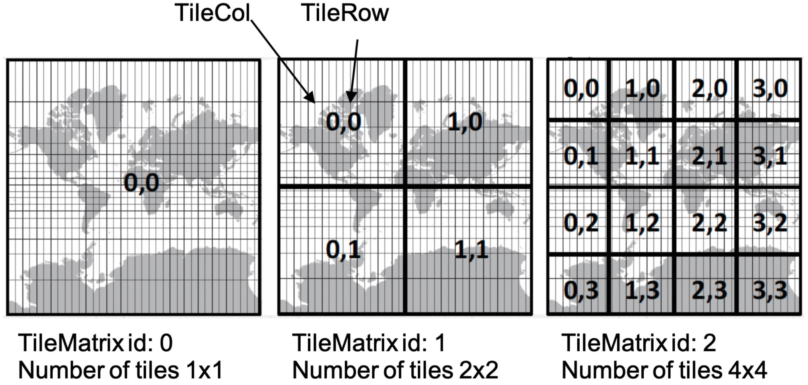
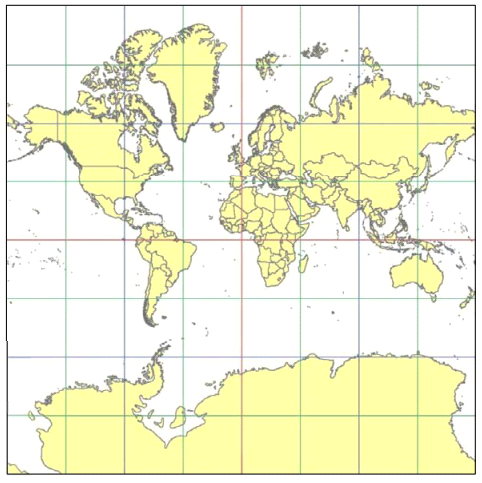
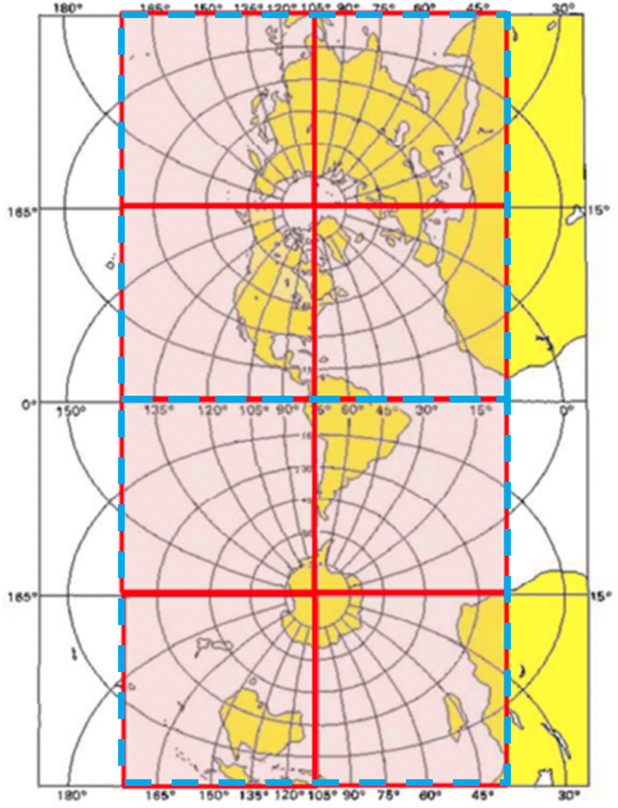
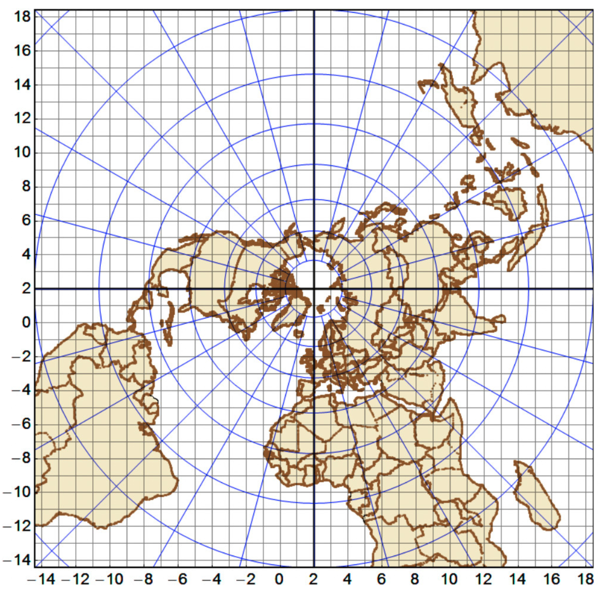
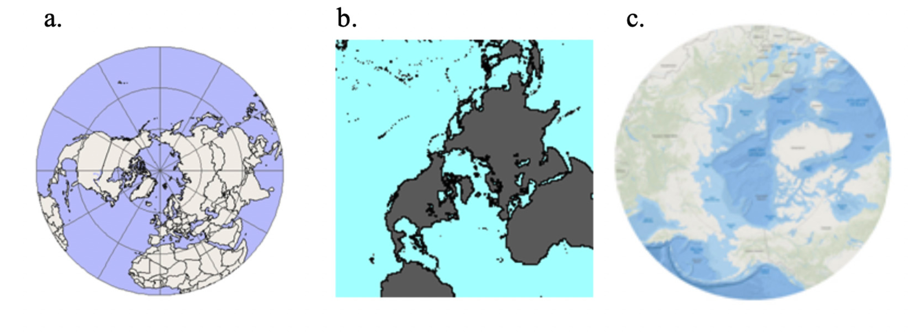
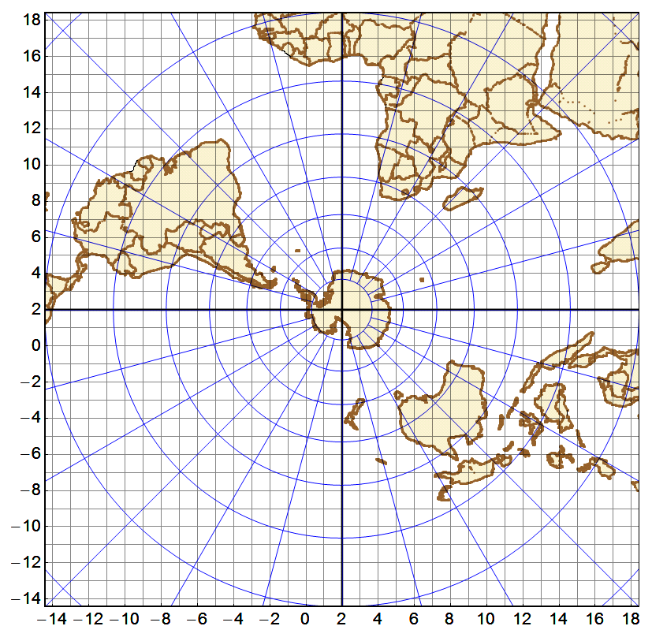

[appendix]
[[annex-common-tilematrixset-definitions-informative]]
:appendix-caption: Annex
== Common TileMatrixSet definitions (Informative)

This Annex includes some definitions for TileMatrixSets that are commonly used.

[[web-mercator-quad-tilematrixset-definition-httpwww.opengis.netdeftilematrixsetogc1.0webmercatorquad]]
=== WebMercatorQuad TileMatrixSet definition

*URI: http://www.opengis.net/def/tilematrixset/OGC/1.0/WebMercatorQuad*

[#definition-of-the-webmercatorquad-tilematrixset,reftext='{table-caption} {counter:table-num}']
.Definition of the WebMercatorQuad TileMatrixSet
[cols="15%,25%,30%,15%,15%",width="100%"]
|===
5+| *CRS*: http://www.opengis.net/def/crs/EPSG/0/3857, WGS 84 / Pseudo-Mercator

*BBOX LowerLeft:* -20,037,508.3427892, -20,037,508.3427892 (lat/long: -85.0511287798, -180)

*BBOX UpperRight:* 20,037,508.3427892, 20,037,508.3427892 (lat/long: 85.0511287798, 180)

*WellKnownScaleSet*: http://www.opengis.net/def/wkss/OGC/1.0/GoogleMapsCompatible

*PointOfOrigin*: -20,037,508.3427892, 20,037,508.3427892

*TileWidth*: 256

*TileHeight*: 256
| *TileMatrix id* | *Scale Denominator* | *Cell Size (m)* | *Matrix Width* | *Matrix Height*
| 0 | 559,082,264.0287178 | 156,543.0339280410 | 1 | 1
| 1 | 279,541,132.0143589 | 78,271.51696402048 | 2 | 2
| 2 | 139,770,566.0071794 | 39,135.75848201023 | 4 | 4
| 3 | 69,885,283.00358972 | 19,567.87924100512 | 8 | 8
| 4 | 34,942,641.50179486 | 9783.939620502561 | 16 | 16
| 5 | 17,471,320.75089743 | 4891.969810251280 | 32 | 32
| 6 | 8,735,660.375448715 | 2445.984905125640 | 64 | 64
| 7 | 4,367,830.187724357 | 1222.992452562820 | 128 | 128
| 8 | 2,183,915.093862179 | 611.4962262814100 | 256 | 256
| 9 | 1,091,957.546931089 | 305.7481131407048 | 512 | 512
| 10 | 545,978.7734655447 | 152.8740565703525 | 1024 | 1024
| 11 | 272,989.3867327723 | 76.43702828517624 | 2048 | 2048
| 12 | 136,494.6933663862 | 38.21851414258813 | 4096 | 4096
| 13 | 68,247.34668319309 | 19.10925707129406 | 8192 | 8192
| 14 | 34,123.67334159654 | 9.554628535647032 | 16,384 | 16,384
| 15 | 17,061.83667079827 | 4.777314267823516 | 32,768 | 32,768
| 16 | 8530.918335399136 | 2.388657133911758 | 65,536 | 65,536
| 17 | 4265.459167699568 | 1.194328566955879 | 131,072 | 131,072
| 18 | 2132.729583849784 | 0.5971642834779395 | 262,144 | 262,144
| 19 | 1066.36479192489 | 0.2985821417389700 | 524,288 | 524,288
| 20 | 533.182395962445 | 0.1492910708694850 | 1,048,576 | 1,048,576
| 21 | 266.591197981222 | 0.0746455354347424 | 2,097,152 | 2,097,152
| 22 | 133.295598990611 | 0.0373227677173712 | 4,194,304 | 4,194,304
| 23 | 66.6477994953056 | 0.0186613838586856 | 8,388,608 | 8,388,608
| 24 | 33.3238997476528 | 0.0093306919293428 | 16,777,216 | 16,777,216
|===

One can define an arbitrary number of zoom levels and do not need to include all the zoom levels defined here. Here, 25 zoom levels are illustrated.

NOTE: Mercator projection distorts the cell size the closer to the poles. The cell sizes provided here are only valid next to the equator in the direction E-W.

NOTE: The CRS code 3857 is the official code for Web Mercator. An unofficial code “900913” (GOOGLE spelled with numbers) was initially assigned and is sometimes still used.

[#img_the-3-first-tile-matrix-of-the-webmercatorquad-tilematrixset-source-cca,reftext='{figure-caption} {counter:figure-num}']
.The 3 first Tile Matrix of the WebMercatorQuad TileMatrixSet (Source CCA)

This tile matrix set is the most used tile matrix set in the mass market: for example, by Google Maps, Microsoft Bing Maps and Open Street Map tiles. Nevertheless, it has been long criticized because it is a based on a spherical Mercator instead of an ellipsoid. The use of WebMercatorQuad should be limited to visualization. Any additional use (including distance measurements, routing etc.) needs to use the Mercator spherical expressions to transform the coordinate to an appropriate CRS first.

NOTE: For example, the EPSG database version 8.9 says about the 3857: “Uses spherical development of ellipsoidal coordinates. Relative to WGS 84 / World Mercator (CRS code 3395) errors of 0.7 percent in scale and differences in northing of up to 43km in the map (equivalent to 21km on the ground) may arise.”

NOTE: The risks caused by imprecision in the use of Web Mercator is also emphasized by the US National Geospatial Agency (NGA). NGA has issued an Advisory Notice on web Mercator (http://earth-info.nga.mil/GandG/wgs84/web_mercator/index.html) that says that “it may cause geo-location / geo-coordinate errors up to 40,000 meters. This erroneous geospatial positioning information poses an unacceptable risk to global safety of navigation activities, and department of defense, intelligence community, and allied partner systems, missions, and operations that require accurate and precise positioning and navigation information.” The use of WorldMercatorWGS84Quad is recommended.

=== WorldCRS84Quad TileMatrixSet definitions

[[world-crs84-quad-tilematrixset-definition-httpwww.opengis.netdeftilematrixsetogc1.0worldcrs84quad]]
==== Variant 1: World CRS84 Quad TileMatrixSet definition (recommended)

*URI: http://www.opengis.net/def/tilematrixset/OGC/1.0/WorldCRS84Quad*

This Tile Matrix Set defines tiles in the Equirectangular Plate Carrée projection in the CRS84 CRS for the whole world.

[#definition-of-the-worldcrs84quad-tilematrixset,reftext='{table-caption} {counter:table-num}']
.Definition of the WorldCRS84Quad TileMatrixSet
[cols="15%,25%,30%,15%,15%",width="100%"]
|===
5+| *CRS*: http://www.opengis.net/def/crs/OGC/1.3/CRS84, CRS84

*BBOX LowerLeft:* -180, -90

*BBOX UpperRight:* 180, 90

*WellKnownScaleSet*: http://www.opengis.net/def/wkss/OGC/1.0/GoogleCRS84Quad

*PointOfOrigin*: -180, 90

*TileWidth*: 256

*TileHeight*: 256
| *TileMatrix id* | *Scale Denominator* | *Cell Size (degrees) (true at the equator)* | *Matrix Width* | *Matrix Height*
| 0 | 279,541,132.0143589 | 0.703125000000000 | 2 | 1
| 1 | 139,770,566.0071794 | 0.351562500000000 | 4 | 2
| 2 | 69,885,283.00358972 | 0.175781250000000 | 8 | 4
| 3 | 34,942,641.50179486 | 8.78906250000000 x 10^-2^ | 16 | 8
| 4 | 17,471,320.75089743 | 4.39453125000000 x 10^-2^ | 32 | 16
| 5 | 87,35,660.375448715 | 2.19726562500000 x 10^-2^ | 64 | 32
| 6 | 4,367,830.187724357 | 1.09863281250000 x 10^-2^ | 128 | 64
| 7 | 2,183,915.093862179 | 5.49316406250000 x 10^-3^ | 256 | 128
| 8 | 1,091,957.546931089 | 2.74658203125000 x 10^-3^ | 512 | 256
| 9 | 545,978.7734655447 | 1.37329101562500 x 10^-3^ | 1024 | 512
| 10 | 272,989.3867327723 | 6.86645507812500 x 10^-4^ | 2048 | 1024
| 11 | 136,494.6933663862 | 3.43322753906250 x 10^-4^ | 4096 | 2048
| 12 | 68,247.34668319309 | 1.71661376953125 x 10^-4^ | 8192 | 4096
| 13 | 34,123.67334159654 | 8.58306884765625 x 10^-5^ | 16,384 | 8192
| 14 | 17,061.83667079827 | 4.29153442382812 x 10^-5^ | 32,768 | 16,384
| 15 | 8530.918335399136 | 2.14576721191406 x 10^-5^ | 65,536 | 32,768
| 16 | 4265.459167699568 | 1.07288360595703 x 10^-5^ | 131,072 | 65,536
| 17 | 2132.729583849784 | 5.36441802978516 x 10^-6^ | 262,144 | 131,072
| 18 | 1066.36479192489 | 2.68220901489258 x 10^-6^ | 524,288 | 262,144
| 19 | 533.182395962445 | 1.34110450744629 x 10^-6^ | 1,048,576 | 524,288
| 20 | 266.591197981222 | 6.70552253723144 x 10^-7^ | 2,097,152 | 1,048,576
| 21 | 133.295598990611 | 3.35276126861572 x 10^-7^ | 41,94,304 | 2,097,152
| 22 | 66.6477994953056 | 1.67638063430786 x 10^-7^ | 8,388,608 | 4,194,304
| 23 | 33.3238997476528 | 8.3819031715393 x 10^-8^ | 16,777,216 | 8,388,608
|===
 
One can define an arbitrary number of zoom levels and do not need to include all the ones defined here. Here, 18 zoom levels are illustrated.

[#img_tile-matrix-id-1,reftext='{figure-caption} {counter:figure-num}']
.Tile Matrix Id 1 (2x1 tiles) of the WorldCRS84Quad TileMatrixSet +
(Source INSPIRE technical guidance)
image::figures/11.png[Tile Matrix Id 1 (2x1 tiles) of the WorldCRS84Quad TileMatrixSet +
(Source INSPIRE technical guidance)]

NOTE: The zoom level identifiers in this TileMatrixSet do not correspond to the same scale values in Annex E.3 of WMTS 1.0. In this TileMatrixSet, the TileMatrix with identifier “-1” has only one tile with 128 lines left blank. For that reason, many implementers do not want to offer this level (including the INSPIRE technical guidance) and prefer to start with a TileMatrix that represents the world with just 2 tiles (one for the negative longitudes and one for the positive longitudes).

NOTE: The scale denominators for this TileMatrixSet and WorldMercatorWGS84Quad and WebMercatorQuad are the same but the identifiers are displaced by one. This might generate confusion.

NOTE: for INSPIRE: The Technical Guidance for the implementation of INSPIRE View Services defines a TileMatrixSet called InspireCRS84Quad that is identical to this one. Note that the current version of the INSPIRE Technical Guidance cited in the Bibliography Annex could accidentally generate confusion because it is comparing a GoogleCRS84Quad (that is a well-known scale set name) with the InspireCRS84Quad (that is a TileMatrixSet definition that does not link to any WKSS).

[[world-crs84-quad-tilematrixset-definition-httpwww.opengis.netdeftilematrixsetogc1.0wgs1984quad]]
==== Variant 2: World EPSG:4326 Quad TileMatrixSet definition

*URI: http://www.opengis.net/def/tilematrixset/OGC/1.0/WGS1984Quad*

Some implementers prefer to define the previous TileMatrixSet using the CRS http://www.opengis.net/def/crs/EPSG/0/4326. The definition is the same as http://www.opengis.net/def/tilematrixset/OGC/1.0/WorldCRS84Quad except that CRS coordinates are expressed in latitude, longitude order, affecting the PointOfOrigin and the BBox encoding only. If possible, the use of http://www.opengis.net/def/tilematrixset/OGC/1.0/WorldCRS84Quad is recommended instead of this one, because it uses coordinates in the same order as the tiles indices. However, we introduce it here to clarify how an implementation based on EPSG:4326 should look like and avoid confusion.

This Tile Matrix Set defines tiles in the Equirectangular Plate Carrée projection in the EPSG:4326 CRS for the whole world.

[#definition-of-the-worldcrs84quad-tilematrixset-4326,reftext='{table-caption} {counter:table-num}']
.Definition of the WorldCRS84Quad TileMatrixSet (EPSG:4326)
[cols="15%,25%,30%,15%,15%",width="100%"]
|===
5+| *CRS*: http://www.opengis.net/def/crs/EPSG/0/4326, EPSG:4326

*BBOX LowerLeft:* -90, -180

*BBOX UpperRight:* 90, 180

*WellKnownScaleSet*: http://www.opengis.net/def/wkss/OGC/1.0/GoogleCRS84Quad

*PointOfOrigin*: 90, -180

*TileWidth*: 256

*TileHeight*: 256
| *TileMatrix id* | *Scale Denominator* | *Cell Size (degrees) (true at the equator)* | *Matrix Width* | *Matrix Height*
| 0 | 279,541,132.0143589 | 0.703125000000000 | 2 | 1
| 1 | 139,770,566.0071794 | 0.351562500000000 | 4 | 2
| 2 | 69,885,283.00358972 | 0.175781250000000 | 8 | 4
| 3 | 34,942,641.50179486 | 8.78906250000000 x 10^-2^ | 16 | 8
| 4 | 17,471,320.75089743 | 4.39453125000000 x 10^-2^ | 32 | 16
| 5 | 8,735,660.375448715 | 2.19726562500000 x 10^-2^ | 64 | 32
| 6 | 4,367,830.187724357 | 1.09863281250000 x 10^-2^ | 128 | 64
| 7 | 2,183,915.093862179 | 5.49316406250000 x 10^-3^ | 256 | 128
| 8 | 1,091,957.546931089 | 2.74658203125000 x 10^-3^ | 512 | 256
| 9 | 545,978.7734655447 | 1.37329101562500 x 10^-3^ | 1024 | 512
| 10 | 272,989.3867327723 | 6.86645507812500 x 10^-4^ | 2048 | 1024
| 11 | 136,494.6933663862 | 3.43322753906250 x 10^-4^ | 4096 | 2048
| 12 | 68,247.34668319309 | 1.71661376953125 x 10^-4^ | 8192 | 4096
| 13 | 34,123.67334159654 | 8.58306884765625 x 10^-5^ | 16,384 | 8192
| 14 | 17,061.83667079827 | 4.29153442382812 x 10^-5^ | 32,768 | 16,384
| 15 | 8530.918335399136 | 2.14576721191406 x 10^-5^ | 65,536 | 32,768
| 16 | 4265.459167699568 | 1.07288360595703 x 10^-5^ | 131,072 | 65,536
| 17 | 2132.729583849784 | 5.36441802978516 x 10^-6^ | 262,144 | 131,072
| 18 | 1066.36479192489 | 2.68220901489258 x 10^-6^ | 524,288 | 262,144
| 19 | 533.182395962445 | 1.34110450744629 x 10^-6^ | 1,048,576 | 524,288
| 20 | 266.591197981222 | 6.70552253723144 x 10^-7^ | 2,097,152 | 1,048,576
| 21 | 133.295598990611 | 3.35276126861572 x 10^-7^ | 4,194,304 | 2,097,152
| 22 | 66.6477994953056 | 1.67638063430786 x 10^-7^ | 8,388,608 | 4,194,304
| 23 | 33.3238997476528 | 8.3819031715393 x 10^-8^ | 16,777,216 | 8,388,608
|===

[[world-mercator-wgs84-quad-tilematrixset-definition-httpwww.opengis.netdeftilematrixsetogc1.0worldmercatorwgs84quad]]
=== WorldMercatorWGS84Quad TileMatrixSet definition

*URI: http://www.opengis.net/def/tilematrixset/OGC/1.0/WorldMercatorWGS84Quad*

[#definition-of-the-worldmercatorwgs84quad-tilematrixset,reftext='{table-caption} {counter:table-num}']
.Definition of the WorldMercatorWGS84Quad TileMatrixSet
[cols="13%,24%,21%,16%,13%,13%",width="100%"]
|===
6+| *CRS*: http://www.opengis.net/def/crs/EPSG/0/3395, WGS 84 / World-Mercator

*BBOX LowerLeft:* -20,037,508.3427892, -20,037,508.3427892  (lat, long: -85.08405903, -180)

*BBOX UpperRight:* 20,037,508.3427892, 20,037,508.3427892 (lat, long: 85.08405903, 180)

*WellKnownScaleSet*: http://www.opengis.net/def/wkss/OGC/1.0/WorldMercatorWGS84

*PointOfOrigin*: -20,037,508.3427892, 20,037,508.3427892

*TileWidth*: 256

*TileHeight*: 256
| *TileMatrix id* | *Scale Denominator* | *Cell Size (m) (true at the equator)* | *Cell Size (m) at latitude ±31.0606963703645 (informative)* | *Matrix Width* | *Matrix Height*
| 0 |559,082,264.02871774 |156,543.033928040 |134,217.728 |1 |1
| 1 |279,541,132.01435887 |78,271.5169640205 |67,108.864 |2 |2
| 2 |139,770,566.00717943 |39,135.7584820102 |33,554.432 |4 |4
| 3 |69,885,283.003589718 |19,567.8792410051 |16,777.216 |8 |8
| 4 |34,942,641.501794859 |9783.93962050256 |8388.608 |16 |16
| 5 |17,471,320.750897429 |4891.96988102512 |4194.304 |32 |32
| 6 |8,735,660.3754487147 |2445.98490512564 |2097.152 |64 |64
| 7 |4,367,830.1877243573 |1222.99245256282 |1048.576 |128 |128
| 8 |2,183,915.0938621786 |611.496226281410 |524.288 |256 |256
| 9 |1,091,957.5469310893 |305.748113140705 |262.144 |512 |512
| 10 |545,978.77346554467 |152.874056570352 |131.072 |1024 |1024
| 11 |272,989.38673277233 |76.4370282851762 |65.536 |2048 |2048
| 12 |136,494.69336638616 |38.2185141425881 |32.768 |4096 |4096
| 13 |68,247.346683193084 |19.1092570712940 |16.384 |8192 |8192
| 14 |34,123.673341596542 |9.55462853564703 |8.192 |16,384 |16,384
| 15 |17,061.836670798271 |4.77731426782351 |4.096 |32,768 |32,768
| 16 |8530.9183353991355 |2.38865713391175 |2.048 |65,536 |65,536
| 17 |4265.4591676995677 |1.19432856695587 |1.024 |131.072 |131.072
| 18 |2132.7295838497838 |0.59716428347793 |0.512 |262,144 |262,144
| 19 |1066.3647919248919 |0.29858214173896 |0.256 |524,288 |524,288
| 20 |533.18239596244597 |0.14929107086948 |0.128 |1,048,576 |1,048,576
| 21 |266.59119798122298 |0.07464553543474 |0.064 |2,097,152 |2,097,152
| 22 |133.29559899061149 |0.03732276771737 |0.032 |4,194,304 |4,194,304
| 23 |66.647799495305746 |0.01866138385868 |0.016 |8,388,608 |8,388,608
| 24 |33.323899747652873 |0.00933069192934 |0.008 |16,777,216 |16,777,216
|===
 

One can define an arbitrary number of zoom levels and do not need to include all the zoom levels defined here. Here, 25 zoom levels are illustrated.

This Tile Matrix Set looks similar to the previous one (Web Mercator Quad) but this one is based on an ellipsoidal Mercator. Please note that the most northern latitude cover by this one is 85.08405903 (different from Web Mercator).

[#img_tile-matrix-id-1-3,reftext='{figure-caption} {counter:figure-num}']
.Tile Matrix Id 1 (red lines; 2x2 tiles) and 3 (blue lines; 8x8 tiles) of the WorldMercatorWGS84Quad TileMatrixSet (Source NGA)

NOTE: The NGA Geomatics Office reminds the community to use DoD approved World Geodetic System 1984 (WGS 84) applications for all mission critical activities and encourages the use of WGS84 based tile matrix sets like this one and discourages the use of Web Mercator tiles based on Web Mercator such as WebMercatorQuad.

NOTE: The NGA Geomatics Office recommends the use of Universal zoom-levels scale set that are defined as true cell size at ±31.0606963703645 degrees of latitude that implies a scale reduction at the equator of 0.857385503731176. This standard recommends the use of scale denominators at the equator for convenience.

[[universal-transverse-mercator-wgs84-quad-family-tilematrixset-definition-httpwww.opengis.netdeftilematrixsetogc1.0utmwgs84quad]]
=== Universal Transverse Mercator WGS84 Quad family TileMatrixSet definition (UTM##WGS84Quad)

*URI: http://www.opengis.net/def/tilematrixset/OGC/1.0/UTM##WGS84Quad*

The Universal Transversal Mercator (a special case of transverse Mercator), divides the world into 60 zones by longitude. No single zone would make a global or near-global map. Therefore, this definition is a family of 60 TileMatrixSets in a single table.

[#definition-of-the-utmwgs84quad-tilematrixsets,reftext='{table-caption} {counter:table-num}']
.Definition of the UTM##WGS84Quad TileMatrixSets
[cols="13%,22%,23%,16%,13%,13%",width="100%"]
|===
6+|*+++##:+++* it is a number that goes from 01 to 60

*CRSs*: [http://www.opengis.net/def/crs/EPSG/0/32601, http://www.opengis.net/def/crs/EPSG/0/32660] WGS 84 / UTM

*BBOX LowerLeft:* -9,501,965.72931276, -20,003,931.4586255; lat, long: -180, -62+(+++##+++-31)+++*+++6

*BBOX UpperRight:* 10,501,965.7293128, 20,003,931.4586255 (lat, long: 180, 68+(+++##+++-31)+++*+++6)

*WellKnownScaleSet*: N/A

*PointOfOrigin*: -9,501,965.72931276, 20,003,931.4586255

*TileWidth*: 256

*TileHeight*: 256

| *TileMatrix id* | *Scale Denominator* | *Cell Size (m) along the central meridian* | *Cell Size (m) at a point on the Equator and at longitude ±30.700524332812+3+(##-31)*6* | *Matrix Width* | *Matrix Height*
| 1 | 279,072,704.500914 | 78,140.3572602559 | 67,108.864 | 1 | 2
| 2 | 139,536,352.250457 | 39,070.178630128 | 33,554.432 | 2 | 4
| 3 | 69,768,176.1252285 | 19,535.089315064 | 16,777.216 | 4 | 8
| 4 | 34,884,088.0626143 | 9767.5446575319 | 8388.608 | 8 | 16
| 5 | 17,442,044.0313071 | 4883.772328766 | 4194.304 | 16 | 32
| 6 | 8,721,022.01565356 | 2441.886164383 | 2097.152 | 32 | 64
| 7 | 4,360,511.00782678 | 1220.9430821915 | 1048.576 | 64 | 128
| 8 | 2,180,255.50391339 | 610.471541095749 | 524.288 | 128 | 256
| 9 | 1,090,127.75195670 | 305.235770547875 | 262.144 | 256 | 512
| 10 | 545,063.875978348 | 152.617885273937 | 131.072 | 512 | 1024
| 11 | 272,531.937989174 | 76.3089426369687 | 65.536 | 1024 | 2048
| 12 | 136,265.968994587 | 38.1544713184843 | 32.768 | 2048 | 4096
| 13 | 68,132.9844972935 | 19.0772356592422 | 16.384 | 4096 | 8192
| 14 | 34,066.4922486467 | 9.53861782962109 | 8.192 | 8192 | 16,384
| 15 | 17,033.2461243234 | 4.76930891481054 | 4.096 | 16,384 | 32,768
| 16 | 8516.62306216168 | 2.38465445740527 | 2.048 | 32,768 | 65,536
| 17 | 4258.31153108084 | 1.19232722870264 | 1.024 | 65,536 | 131.072
| 18 | 2129.15576554042 | 0.596163614351318 | 0.512 | 131.072 | 262,144
| 19 | 1064.57788277021 | 0.298081807175659 | 0.256 | 262,144 | 524,288
| 20 | 532.288941385105 | 0.149040903587829 | 0.128 | 524,288 | 1,048,576
| 21 | 266.144470692553 | 0.0745204517939147 | 0.064 | 1,048,576 | 2,097,152
| 22 | 133.072235346276 | 0.0372602258969574 | 0.032 | 2,097,152 | 4,194,304
| 23 | 66.5361176731382 | 0.0186301129484787 | 0.016 | 4,194,304 | 8,388,608
| 24 | 33.2680588365691 | 0.00931505647423934 | 0.008 | 8,388,608 | 16,777,216
|===
 

One can define an arbitrary number of zoom levels and do not need to include all the zoom levels defined here. Here, 24 zoom levels are illustrated.

NOTE: The southern hemisphere ([http://www.opengis.net/def/crs/EPSG/0/32701, http://www.opengis.net/def/crs/EPSG/0/32760]) is covered by extending the UTM northern CRSs to the south in a way that the southern hemisphere CRSs are neither used nor needed.

NOTE: The UTM projection is supposed to be used in zones that are only 3 degrees apart from the central meridian forming 6-degree wide zones. In some parts of the world, it is useful to relax this limitation to cover a wider object (for example, Spain can be fully represented in UTM30 zone if the 3-degree limit is relaxed). The farther one goes from the central meridian, the more deformations is experienced in the projection. The top left corner of this tile matrix set has been defined 65 degrees apart of the central meridian to allow much more extreme cases, but it is highly recommended that applications limit themselves to the 6-degree wide central area and use TileMatrixSetLimits to define actual boundaries of the tile indices used in this area.

[#img_tile-matrix-id-1-2,reftext='{figure-caption} {counter:figure-num}']
.Tile Matrix Id 1 (dashed blue lines; 1x2 tiles) and 2 (red lines; 2x4 tiles) of the UTM18WGS84Quad TileMatrixSet (Source NGA)

NOTE: The NGA Geomatics Office recommends the use of Universal zoom-levels scale set that are defined as true cell size at ±30.700524332812 degrees of longitude at both sides of the central meridian that implies a scale reduction at the central meridian of 0.85882463752355. The tiles considering this scale are exactly the same than considering true cell size at the equation and no scale reduction. This standard recommends the use of scale denominators at the equator for convenience.

[[arctic-universal-polar-stereographic-wgs-84-quad-tilematrixset-definition-httpwww.opengis.netdeftilematrixsetogc1.0upsarcticwgs84quad]]
=== Arctic Universal Polar Stereographic WGS 84 Quad TileMatrixSet definition (UPSArcticWGS84Quad)

*URI: http://www.opengis.net/def/tilematrixset/OGC/1.0/UPSArcticWGS84Quad*

It is difficult to find consensus in the geospatial community for what constitutes the “best” tile matrix set for the polar areas. Even if everyone agrees on using a polar stereographic, the election of the PointOfOrigin and scale denominators is almost arbitrary. This document presents the NGA recommendation for polar stereographic that allows for the representation of more than one hemisphere to 15 degrees into the opposite hemisphere and shares a common set of cell sizes with the WorldMercatorWGS84Quad and the UTM##WGS84Quad. The selection of a CRS for a polar stereographic is difficult and this document follows several criteria (see NOTE 2). In the end, the UPS North that is commonly used in conjunction with UTM was selected.

NOTE: In Mercator or Transversal Mercator projections the first scale denominator and top left corner are selected in a way that a single tile can cover all ranges of longitudes or latitudes respectively. Due to the nature of this projection, these criteria cannot be applied. The top left corner selection deeply depends on the application. The very distant top left corner was selected here to include as many applications as possible.

[#definition-of-the-upsarcticwgs84quad-tilematrixset,reftext='{table-caption} {counter:table-num}']
.Definition of the UPSArcticWGS84Quad TileMatrixSet
[width = "100%"]
|===
6+| *CRS*: http://www.opengis.net/def/crs/EPSG/0/5041, WGS 84 Universal Polar Stereographic North

*BBOX LowerLeft:* -14,440,759.350252, -14,440,759.350252

*BBOX UpperRight:* 18,440,759.350252, 18,440,759.350252

*WellKnownScaleSet*: N/A

*PointOfOrigin*: -14,440,759.350252, 18,440,759.350252

*TileWidth*: 256

*TileHeight*: 256
| *Tile Matrix id* | *Scale Denominator* | *Cell Size (m) (true at latitude  ~81)* | *True Cell Size (m) at the pole (informative)* | *Matrix Width* | *Matrix Height*
| 0 | 458,726,544.4 | 128,443.4324 | 129,218.7449 | 1 | 1
| 1 | 229,363,272.2 | 64,221.71621 | 64,609.37245 | 2 | 2
| 2 | 114,681,636.1 | 32,110.85811 | 32,304.68622 | 4 | 4
| 3 | 57,340,818.05 | 16,055.42905 | 16,152.34311 | 8 | 8
| 4 | 28,670,409.02 | 8027.714526 | 8076.171556 | 16 | 16
| 5 | 14,335,204.51 | 4013.857263 | 4038.085778 | 32 | 32
| 6 | 7,167,602.256 | 2006.928632 | 2019.042889 | 64 | 64
| 7 | 3,583,801.128 | 1003.464316 | 1009.521444 | 128 | 128
| 8 | 1,791,900.564 | 501.7321579 | 504.7607222 | 256 | 256
| 9 | 895,950.282 | 250.866079 | 252.3803611 | 512 | 512
| 10 | 447,975.141 | 125.4330395 | 126.1901806 | 1024 | 1024
| 11 | 223,987.5705 | 62.71651974 | 63.09509028 | 2048 | 2048
| 12 | 111,993.7852 | 31.35825987 | 31.54754514 | 4096 | 4096
| 13 | 55,996.89262 | 15.67912993 | 15.77377257 | 8192 | 8192
| 14 | 27,998.44631 | 7.839564967 | 7.886886285 | 16,384 | 16,384
| 15 | 13,999.22316 | 3.919782484 | 3.943443142 | 32,768 | 32,768
| 16 | 6999.611578 | 1.959891242 | 1.971721571 | 65,536 | 65,536
| 17 | 3499.805789 | 0.979945621 | 0.985860786 | 131.072 | 131.072
| 18 | 1749.902894 | 0.48997281 | 0.492930393 | 262,144 | 262,144
| 19 | 874.9514472 | 0.244986405 | 0.246465196 | 524,288 | 524,288
| 20 | 437.4757236 | 0.122493203 | 0.123232598 | 1,048,576 | 1,048,576
| 21 | 218.7378618 | 0.061246601 | 0.061616299 | 2,097,152 | 2,097,152
| 22 | 109.3689309 | 0.030623301 | 0.03080815 | 4,194,304 | 4,194,304
| 23 | 54.68446545 | 0.01531165 | 0.015404075 | 8,388,608 | 8,388,608
| 24 | 27.34223273 | 0.007655825 | 0.007702037 | 16,777,216 | 16,777,216
|===
 

One can define an arbitrary number of zoom levels and does not need to include all the zoom levels defined here. Here, 25 zoom levels are illustrated.

[#img_tile-martix-id-0-1,reftext='{figure-caption} {counter:figure-num}']
.Tile Matrix Id 0 (exterior line; 1x1 tile) and 1 (blank lines; 2x2 tiles) of the UPSArcticWGS84Quad TileMatrixSet (Source NGA)

NOTE: In practice, there are many polar stereographic CRS and it is difficult to prioritize one. In many occasions, the meridian of origin is selected in order to rotate the projection and allow a region to become more prominent. Examples are rotations emphasizing Greenland or Alaska. To be general, the 0 meridian of origin was selected. In addition, polar projections have a variety of standard parallels and here is selected 90N. In the UPS system, the North Pole is assigned the coordinates x=2,000,000, y=2,000,000.

NOTE: NGA has suggested also another TileMatrixSet called _sixteenth tile_ that covers less area by having the _PointOfOrigin_ at 2,110,189.837563, 6,110,189.837563, BBOX LowerLeft: 2,110,189.837562966, -2,110,189.837562966 and BBOX UpperRight: 6,110,189.837562966, 6,110,189.837562966. The same result can be achieved by using the TileMatrixSetLimits mechanism without having to define an entirely new TileMatrixSet.

[#img_rotation-of-the-meridian,reftext='{figure-caption} {counter:figure-num}']
.Rotation of the meridian of origin to allow a region to become more prominent (a. EPSG:3995, Arctic WGS 84 Polar Stereographic, b. EPSG:3413 WGS 84 / NSIDC Polar Stereographic North, c. EPSG:5936 / Alaska Polar Stereographic). This TileMatrixSet has 0 rotation angle for the meridian of origin.

[[antarctic-universal-polar-stereographic-wgs84-quad-tilematrixset-definition-httpwww.opengis.netdeftilematrixsetogc1.0-upsantarcticwgs84quad]]
=== Antarctic Universal Polar Stereographic WGS84 Quad TileMatrixSet definition (UPSAntarcticWGS84Quad)

*URI: http://www.opengis.net/def/tilematrixset/OGC/1.0/UPSAntarcticWGS84Quad*

There is no consensus in the geospatial community for what constitutes the “best” tile matrix set for the polar stereographic projection. One reason for this is that the election of the PointOfOrigin and scale denominators is almost completely arbitrary. In this document, a TileMatrixSet identical to the Arctic one but with and Antarctic CRS was selected.

[#definition-of-the-upsantarcticwgs84quad-tilematrixset,reftext='{table-caption} {counter:table-num}']
.Definition of the UPSAntarcticWGS84Quad TileMatrixSet
[width = "100%"]
|===
6+| *CRS*: http://www.opengis.net/def/crs/EPSG/0/5042, WGS 84 Universal Polar Stereographic South

*BBOX LowerLeft:* -14,440,759.350252, -14,440,759.350252

*BBOX UpperRight:* 18,440,759.350252, 18,440,759.350252

*WellKnownScaleSet*: N/A

*PointOfOrigin*: -14,440,759.350252, 18,440,759.350252

*TileWidth*: 256

*TileHeight*: 256

| *Tile Matrix id* | *Scale Denominator* | *Cell Size (m) (true at latitude  ~-81)* | *True Cell Size (m) at the pole (informative)* | *Matrix Width* | *Matrix Height*
| 0 | 458,726,544.4 | 128,443.4324 | 129,218.7449 | 1 | 1
| 1 | 229,363,272.2 | 64,221.71621 | 64,609.37245 | 2 | 2
| 2 | 114,681,636.1 | 32,110.85811 | 32,304.68622 | 4 | 4
| 3 | 57,340,818.05 | 16,055.42905 | 16,152.34311 | 8 | 8
| 4 | 28,670,409.02 | 8027.714526 | 8076.171556 | 16 | 16
| 5 | 14,335,204.51 | 4013.857263 | 4038.085778 | 32 | 32
| 6 | 7,167,602.256 | 2006.928632 | 2019.042889 | 64 | 64
| 7 | 3,583,801.128 | 1003.464316 | 1009.521444 | 128 | 128
| 8 | 1,791,900.564 | 501.7321579 | 504.7607222 | 256 | 256
| 9 | 895,950.282 | 250.866079 | 252.3803611 | 512 | 512
| 10 | 447,975.141 | 125.4330395 | 126.1901806 | 1024 | 1024
| 11 | 223,987.5705 | 62.71651974 | 63.09509028 | 2048 | 2048
| 12 | 111,993.7852 | 31.35825987 | 31.54754514 | 4096 | 4096
| 13 | 55,996.89262 | 15.67912993 | 15.77377257 | 8192 | 8192
| 14 | 27,998.44631 | 7.839564967 | 7.886886285 | 16,384 | 16,384
| 15 | 13,999.22316 | 3.919782484 | 3.943443142 | 32,768 | 32,768
| 16 | 6999.611578 | 1.959891242 | 1.971721571 | 65,536 | 65,536
| 17 | 3499.805789 | 0.979945621 | 0.985860786 | 131.072 | 131.072
| 18 | 1749.902894 | 0.48997281 | 0.492930393 | 262,144 | 262,144
| 19 | 874.9514472 | 0.244986405 | 0.246465196 | 524,288 | 524,288
| 20 | 437.4757236 | 0.122493203 | 0.123232598 | 1,048,576 | 1,048,576
| 21 | 218.7378618 | 0.061246601 | 0.061616299 | 2,097,152 | 2,097,152
| 22 | 109.3689309 | 0.030623301 | 0.03080815 | 4,194,304 | 4,194,304
| 23 | 54.68446545 | 0.01531165 | 0.015404075 | 8,388,608 | 8,388,608
| 24 | 27.34223273 | 0.007655825 | 0.007702037 | 16,777,216 | 16,777,216
|===
 

One can define an arbitrary number of zoom levels and does not need to include all the zoom levels defined here. Here, 25 zoom levels are illustrated.

[#img_tile-matrix-id-0-1-ups,reftext='{figure-caption} {counter:figure-num}']
.Tile Matrix Id 0 (exterior line; 1x1 tile) and 1 (black lines; 2x2 tiles) of the UPSAntarcticWGS84Quad TileMatrixSet (Source NGA)

 

[[european-etrs89-laea-quad-tilematrixset-definition-httpwww.opengis.netdeftilematrixsetogc1.0europeanetrs89_laeaquad]]
=== European ETRS89 Lambert azimuthal equal-area Quad TileMatrixSet definition (EuropeanETRS89_LAEAQuad)

*URI: http://www.opengis.net/def/tilematrixset/OGC/1.0/EuropeanETRS89_LAEAQuad*

[#definition-of-the-europeanetrs89_laeaquad-tilematrixset,reftext='{table-caption} {counter:table-num}']
.Definition of the EuropeanETRS89_LAEAQuad TileMatrixSet
[cols="15%,25%,30%,15%,15%",width="100%"]
|===
5+| *CRS*: http://www.opengis.net/def/crs/EPSG/0/3035, ETRS89

*BBOX LowerLeft:* 2,000,000.0, 1,000,000.0

*BBOX UpperRight:* 6,500,000, 5,500,000.0

*WellKnownScaleSet*: N/A

*PointOfOrigin*: 2,000,000.0, 5,500,000.0

*TileWidth*: 256

*TileHeight*: 256
| *TileMatrix id* | *Scale Denominator* | *Cell Size (m)* | *Matrix Width* | *Matrix Height*
| 0 |62,779,017.857142866 |17,578.1250000000 |1 |1
| 1 |31,389,508.928571433 |8789.0625000000 |2 |2
| 2 |15,694,754.464285716 |4394.5312500000 |4 |4
| 3 |78,47,377.232142858 |2197.2656250000 |8 |8
| 4 |3,923,688.616071429 |1098.6328125000 |16 |16
| 5 |1,961,844.3080357146 |549.3164062500 |32 |32
| 6 |980,922.1540178573 |274.6582031250 |64 |64
| 7 |490,461.07700892864 |137.3291015625 |128 |128
| 8 |245,230.53850446432 |68.6645507812 |256 |256
| 9 |122,615.26925223216 |34.3322753906 |512 |512
| 10 |61,307.63462611608 |17.1661376953 |1024 |1024
| 11 |30,653.81731305804 |8.5830688477 |2048 |2048
| 12 |15,326.90865652902 |4.2915344238 |4096 |4096
| 13 |7663.45432826451 |2.1457672119 |8192 |8192
| 14 |3831.727164132255 |1.0728836060 |16,384 |16,384
| 15 |1915.8635820661275 |0.5364418030 |32,768 |32,768
|===
 

One can define an arbitrary number of zoom levels and does not need to include all the zoom levels defined here. Here, 16 zoom levels are illustrated.

[[canadian-nad83-lcc-tilematrixset-definition-httpwww.opengis.netdeftilematrixsetogc1.0canadiannad83_lcc]]
=== Canadian NAD83 Lambert Conformal Conic TileMatrixSet definition (CanadianNAD83_LCC)

*URI: http://www.opengis.net/def/tilematrixset/OGC/1.0/CanadianNAD83_LCC*

[#Definition-of-the-canadiannad83_lcc-tilematrixset,reftext='{table-caption} {counter:table-num}']
.Definition of the CanadianNAD83_LCC TileMatrixSet
[cols="14%,16%,16%,16%,14%,12%,12%",width="100%"]
|===
7+| *CRS*: http://www.opengis.net/def/crs/EPSG/0/3978, NAD83

*BBOX LowerLeft:* -7,786,476.885838887, -5,153,821.09213678

*BBOX UpperRight:* 7,148,753.233541353, 7,928,343.534071138

*WellKnownScaleSet*: N/A

*PointOfOrigin*: -34,655,800, 39,310,000

*TileWidth*: 256

*TileHeight*: 256
| *TileMatrix id* | *Scale Denominator* | *Scale Denominator at latitudes 37.897505 and 83.3032475 (informative)* | *Cartographic product (informative)* | *Cell Size (m) (true at the equator)* | *Matrix Width* | *Matrix Height*
| 0 | 137,016,643.1 | 145,000,000 | World | 38,364.66006 | 5 | 5
| 1 | 80,320,101.12 | 85,000,000 | World | 22,489.62831 | 8 | 8
| 2 | 47,247,118.3 | 50,000,000 | Atlas SM | 13,229.19313 | 13 | 14
| 3 | 28,348,270.98 | 30,000,000 | Atlas SM | 7937.515875 | 21 | 22
| 4 | 16,536,491.41 | 17,500,000 | Atlas SM | 4630.217594 | 36 | 38
| 5 | 9,449,423.661 | 10,000,000 | Atlas MID | 2645.838625 | 62 | 66
| 6 | 5,669,654.196 | 6,000,000 | Atlas MID | 1587.503175 | 103 | 110
| 7 | 3,307,298.281 | 3,500,000 | Atlas MID | 926.0435188 | 177 | 188
| 8 | 1,889,884.732 | 2,000,000 | Atlas LG | 529.167725 | 309 | 329
| 9 | 1,133,930.839 | 1,200,000 | Atlas LG | 317.500635 | 515 | 548
| 10 | 661,459.6563 | 700,000 | Atlas LG | 185.2087038 | 882 | 938
| 11 | 396,875.7938 | 420,000 | NTDB 250K | 111.1252223 | 1470 | 1563
| 12 | 236,235.5915 | 250,000 | NTDB 250K | 66.14596563 | 2469 | 2626
| 13 | 137,016.6431 | 145,000 | NTDB 250K | 38.36466006 | 4257 | 4528
| 14 | 80,320.10112 | 85,000 | NTDB 50K | 22.48962831 | 7262 | 7723
| 15 | 47,247.1183 | 50,000 | NTDB 50K | 13.22919313 | 12,344 | 13,130
| 16 | 28,348.27098 | 30,000 | NTDB 50K | 7.937515875 | 20,574 | 21,882
| 17 | 16,536.49141 | 17,500 | Geobase | 4.630217594 | 35,269 | 37,512
| 18 | 9449.423661 | 10,000 | Geobase | 2.645838625 | 61,720 | 65,646
| 19 | 5669.654196 | 6000 | Geobase | 1.587503175 | 102,866 | 109,409
| 20 | 3307.298281 | 3500 | Geobase | 0.926043519 | 176,341 | 187,558
| 21 | 1889.884732 | 2000 | Geobase | 0.529167725 | 308,596 | 328,227
| 22 | 1133.930839 | 1200 | Geobase | 0.317500635 | 514,327 | 547,044
| 23 | 661.4596563 | 700 |   | 0.185208704 | 881,703 | 937,790
| 24 | 396.8757938 | 420 |   | 0.111125222 | 1,469,505 | 1,562,983
| 25 | 236.2355915 | 250 |   | 0.066145966 | 2,468,768 | 2,625,811
|===
 

One can define an arbitrary number of zoom levels and does not need to include all the zoom levels defined here. Here, 26 zoom levels are illustrated.
