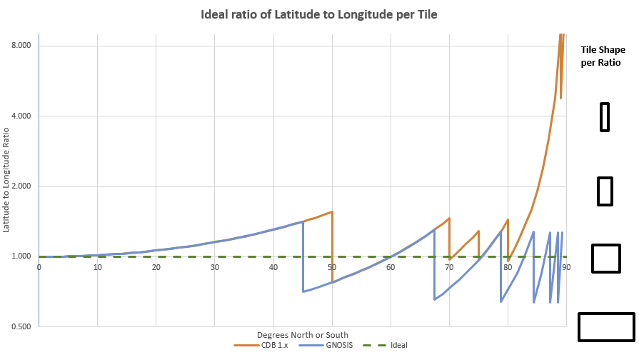
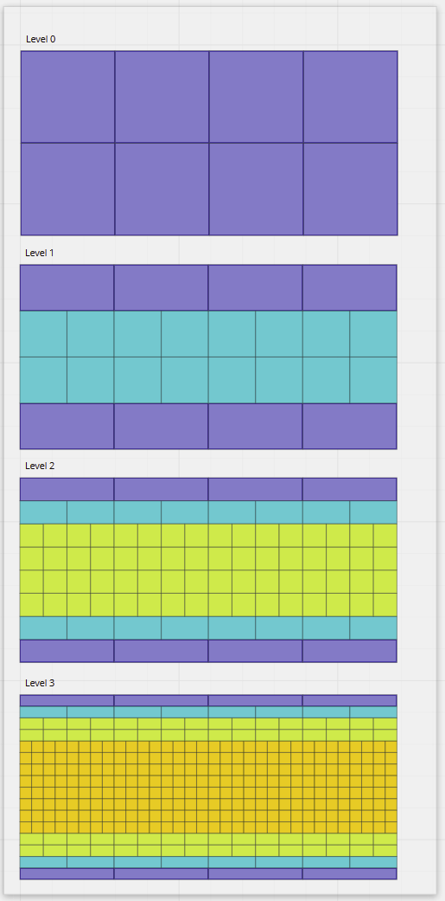
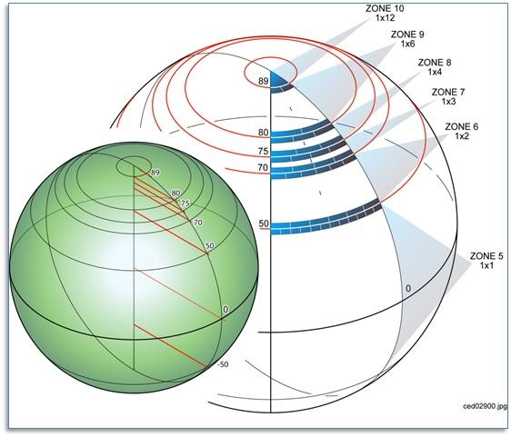
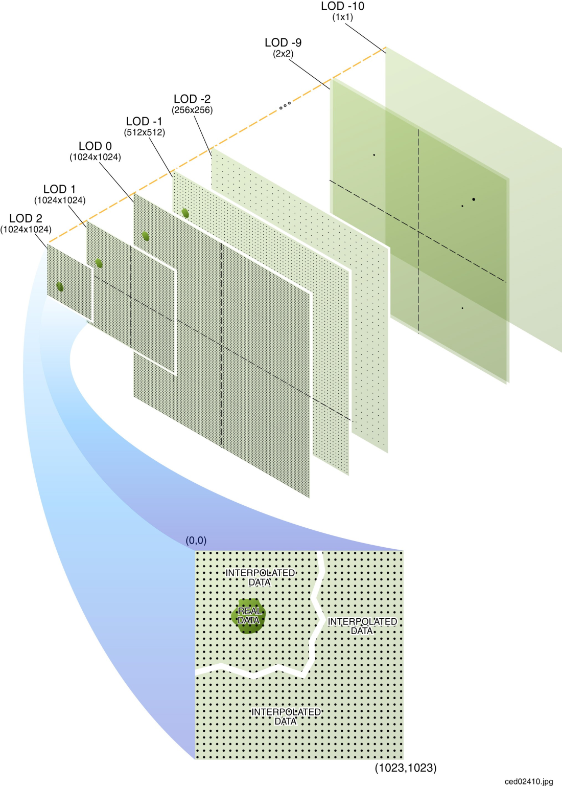

[appendix]
[[annex-variable-tilematrixset-definitions-informative]]
:appendix-caption: Annex
== Variable width TileMatrixSet definitions (Informative)

This annex includes definitions for TileMatrixSets utilizing the variable width capability.
This capability allows to coalesce tiles of specific rows so that the overwall width of the tile matrix is divided among fewer tiles.
This is particularly well suited to define global grids in an Equirectangular Plate Carrée projection, where tiles closer to the pole cover a smaller physical area
than tiles at the equator.

Such TileMatrixSets may therefore attempt to approximate equal area tiles.
Because the resulting tiles would likely only tend towards equal area but still be off by a significant margin,
they cannot be considered a Discrete Global Grid Systems (DGGS) per http://www.opengis.net/doc/AS/dggs/1.0[OGC Abstract Specification Topic 21 - Part 1] which specifies
a maximum threshold of 1% difference. However, they may qualify as an _Axis-Aligned DGGS_ per _OGC Abstract Specification Topic 21 - Part 4_ introduced in version 2.

[#img_ggg-cdb,reftext='{figure-caption} {counter:figure-num}']
.A comparison of variable width tile matrix sets against the ideal tile shape (source: CDB X sprint)

[[gnosis-global-grid-tilematrixset-definition]]
=== GNOSISGlobalGrid TileMatrixSet definition

*URI: http://www.opengis.net/def/tilematrixset/OGC/1.0/GNOSISGlobalGrid*

[#definition-of-the-gnosisglobalgrid-tilematrixset,reftext='{table-caption} {counter:table-num}']

The https://ecere.ca/gnosis/[GNOSIS] Global Grid Tile Matrix Set defines tiles in the Equirectangular Plate Carrée projection (EPSG:4326 CRS)
for the whole world while still attempting to approximate equal area tiles, even near the poles.

Starting at the tile matrix with identifier 1, a variable matrix coalescence factor is applied for polar tiles to tend towards equal area.

[#img_ggg,reftext='{figure-caption} {counter:figure-num}']
.GNOSIS Global Grid (TileMatrix Id 2)
image::figures/5.png[]

.Definition of the GNOSISGlobalGrid TileMatrixSet
[cols="15%,22%,23%,12%,12%,16%"]
|===
6+| *CRS*: http://www.opengis.net/def/crs/EPSG/0/4326, EPSG:4326 +
*BBOX LowerLeft:* -90, -180 +
*BBOX UpperRight:* 90, 180 +
*WellKnownScaleSet*: http://www.opengis.net/def/wkss/OGC/1.0/GoogleCRS84Quad +
*PointOfOrigin*: 90, -180 +
*TileWidth*: 256 +
*TileHeight*: 256
| *TileMatrix id* | *Scale Denominator* | *Cell Size (degrees) (true at the equator)* | *Matrix Width (c=1)* | *Matrix Height* | *Coalescing Coefficient (c)*
| 0 | 139,770,566.0071794 | 0.3515625 | 4 | 2 |
.2+| 1 .2+| 69,885,283.00358972 .2+| 0.17578125 .2+| 8 .2+| 4 | _Row 0_: *2*
                                                    | _Row 3_: *2*
.4+| 2 .4+| 34,942,641.50179486 .4+| 8.7890625 x 10^-2^ .4+| 16 .4+| 8 | _Row 0_: *4*
                                                    | _Row 1:_ *2*
                                                    | _Row 6:_ *2*
                                                    | _Row 7:_ *4*
.6+| 3 .6+| 17,471,320.75089743 .6+| 4.39453125 x 10^-2^ .6+| 32 .6+| 16 | _Row 0:_ *8*
                                                    | _Row 1:_ *4*
                                                    | _Rows 2..3:_ *2*
                                                    | _Rows 12..13:_ *2*
                                                    | _Row 14:_ *4*
                                                    | _Row 15:_ *8*
.8+| 4 .8+| 8,735,660.375448715 .8+| 2.197265625 x 10^-2^ .8+| 64 .8+| 32 | _Row 0:_ *16*
                                                    | _Row 1:_ *8*
                                                    | _Rows 2..3:_ *4*
                                                    | _Rows 4..7:_ *2*
                                                    | _Rows 24..27:_ *2*
                                                    | _Rows 28..29:_ *4*
                                                    | _Row 30:_ *8*
                                                    | _Row 31:_ *16*
.10+| 5 .10+| 4,367,830.187724357 .10+| 1.0986328125 x 10^-2^ .10+| 128 .10+| 64 | _Row 0:_ *32*
| _Row 1:_ *16*
| _Rows 2..3:_ *8*
| _Rows 4..7:_ *4*
| _Rows 8..15:_ *2*
| _Rows 48..55:_ *2*
| _Rows 56..59:_ *4*
| _Rows 60..61:_ *8*
| _Row 62:_ *16*
| _Row 63:_ *32*
|===

One can define an arbitrary number of zoom levels and do not need to include all the ones defined here. Here, 6 zoom levels are illustrated.
Levels 0..28 are officially defined, allowing to reach 2:1 scale while the matrix, row and column identifiers can still fit within a single 64-bit key.

It is easy to implement procedurally: it is a quad-tree starting with 8 90 degrees x 90 degrees tiles at level 0,
with the exception that tiles touching a pole are split into 3 tiles rather than 4 -- the polar portion is not split longitude-wise.
Therefore there will always be only 4 tiles touching each pole.

NOTE: The GNOSIS Global Grid scales match the _GoogleCRS84Quad_ Well Known Scale Set, but starts at the third scale of the set.

NOTE: Aside from the variable width considerations, the only other difference with the
<<world-crs84-quad-tilematrixset-definition-httpwww.opengis.netdeftilematrixsetogc1.0wgs1984quad,WorldCRS84Quad TileMatrixSet>>
is the fact that the latter starts at the second scale of the WKSS -- its TileMatrix identifier 1 is equivalent to
the GNOSISGlobalGrid TileMatrix identifier 0.

[#img_ggg_0_3,reftext='{figure-caption} {counter:figure-num}']
.GNOSIS Global Grid (TileMatrices Id 0-3)

[[cdb-global-grid-tilematrixset-definition]]
=== CDBGlobalGrid TileMatrixSet definition

*URI: http://www.opengis.net/def/tilematrixset/OGC/1.0/CDBGlobalGrid*

[#definition-of-the-cdbglobalgrid-tilematrixset,reftext='{table-caption} {counter:table-num}']

This CDB Global Grid Tile Matrix Set defines tiles in the Equirectangular Plate Carrée projection (EPSG:4326 CRS) for the whole world, based
on the level of details and zones defined by the https://docs.ogc.org/is/15-113r6/15-113r6.html[OGC CDB 1.x] specifications,
which can be encoded following this standard with the use of variable widths.

.Definition of the CDBGlobalGrid TileMatrixSet
[width="100%",cols="13%,18%,17%,13%,10%,10%,19%"]
|===
7+| *CRS*: http://www.opengis.net/def/crs/EPSG/0/4326, EPSG:4326 +
*BBOX LowerLeft:* -90, -180 +
*BBOX UpperRight:* 90, 180 +
*PointOfOrigin*: 90, -180 +
*TileWidth & TileHeight*: 1024 (for tile matrices id 0 and up)
| *TileMatrix id* | *Scale Denominator* | *Cell Size (degrees) (true at the equator)* | *Tile Width & Height* | *Matrix Width (c=1)* | *Matrix Height* | *Coalescing Coefficient (c)*
.10+| -1 .10+| 776,503.144 .10+| 0.001953125 .10+| 512 .10+| 360 .10+| 180 | _Row 0:_ *12*
| _Rows 1..9:_ *6*
| _Rows 10..14:_ *4*
| _Rows 15..19:_ *3*
| _Rows 20..39:_ *2*
| _Rows 140..159:_ *2*
| _Rows 160..164:_ *3*
| _Rows 165..169:_ *4*
| _Rows 170..178:_ *6*
| _Row 179:_ *12*
.10+| 0 .10+| 388,251.572 .10+| 0.009765625 .10+| 1024 .10+| 360 .10+| 180 | _Row 0:_ *12*
| _Rows 1..9:_ *6*
| _Rows 10..14:_ *4*
| _Rows 15..19:_ *3*
| _Rows 20..39:_ *2*
| _Rows 140..159:_ *2*
| _Rows 160..164:_ *3*
| _Rows 165..169:_ *4*
| _Rows 170..178:_ *6*
| _Row 179:_ *12*
.10+| 1 .10+| 194,125.786 .10+| 0.004882813 .10+| 1024 .10+| 720 .10+| 360 |_Row 0:_ *12*
| _Rows 1..9:_ *6*
| _Rows 10..14:_ *4*
| _Rows 15..19:_ *3*
| _Rows 20..39:_ *2*
| _Rows 140..159:_ *2*
| _Rows 160..164:_ *3*
| _Rows 165..169:_ *4*
| _Rows 170..178:_ *6*
| _Row 179:_ *12*
|===

For the tile matrices with negative identifiers of the CDB Global Grid, the tiles' geographic extents remain the same as those of tile matrix 0,
but the tile size in cells is reduced. The levels -1 to 1 are shown here.
For the CDB Global Grid, the polar adjustment zones corresponding to coalescence factors are the same for all tile matrices of the set.

[#img_cdb_zones,reftext='{figure-caption} {counter:figure-num}']
.CDB Zones (from OGC CDB Volume 1)

One can define an arbitrary number of zoom levels and do not need to include all the ones defined here. Here, 3 zoom levels are illustrated.

[#img_cdb_LODs,reftext='{figure-caption} {counter:figure-num}']
.CDB Level of Details (from OGC CDB Volume 1)

