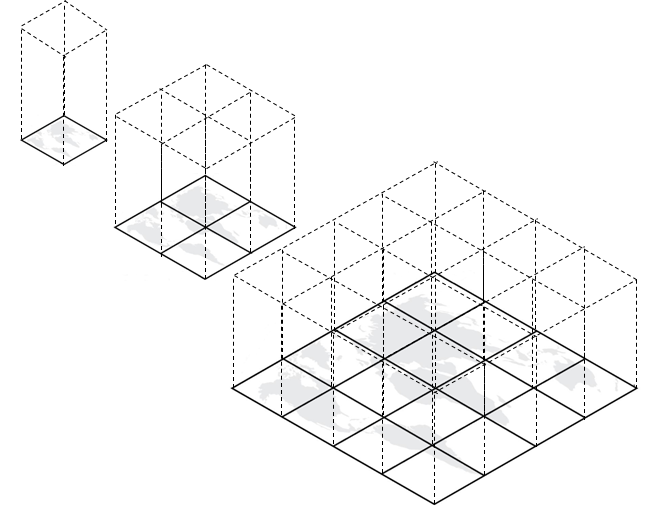
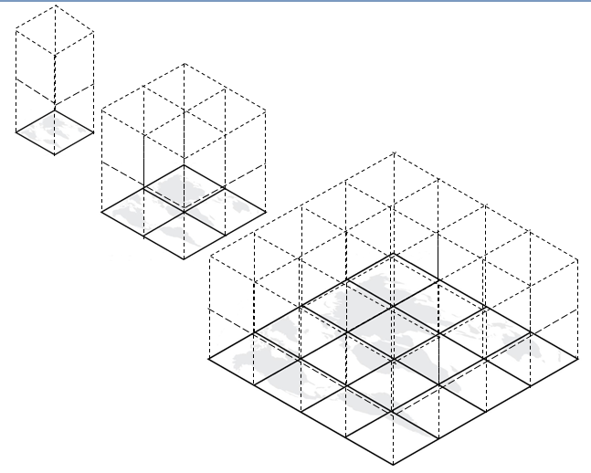
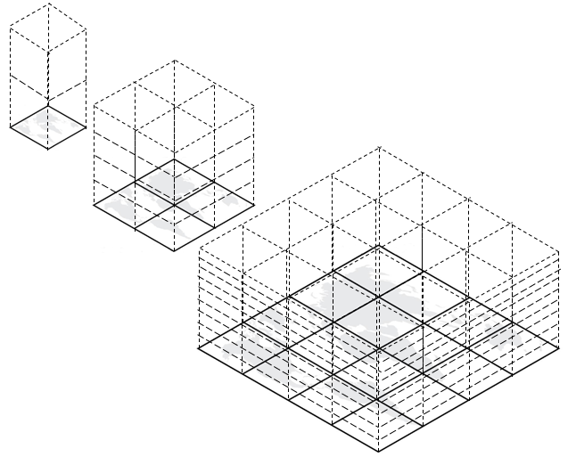

[appendix]
[[annex-extending-additional-dimensinos]]
:appendix-caption: Annex
== Extending TileMatrixSets for additional dimensions (Informative)

This informative annex proposes approaches to extending TileMatrixSets and TileSet metadata for storing, indexing and accessing as tiles 3D, 4D and n-D (n > 2) data,
regardless of whether a simple file-based data store, a database (e.g. a GeoPackage) or a web API is used.

=== Extension approaches

All of these approaches assume that the multi-dimensional content still spans the two dimensions defined by 2D TileMatrixSets, which are
usually latitude and longitude for geographic CRSes, and X/Easting or Y/Northing for projected CRSes.
It is possible for a TileSet CRS to have more than two dimensions, as well as to re-use a common TileMatrixSet using a compatible CRS including
additional dimensions, as specified in <<TileMatrixSetCRSCompatibility>>.

==== No explicit tiling of extra dimensions

One way to extend the use of TileMatrixSet to support additional dimensions is to simply regroup all content falling within a 2D tile boundary of the
TileMatrixSet together in the same tile, for the full extent of those additional dimensions.

[#img_nd_extend,reftext='{figure-caption} {counter:figure-num}']
.Extending TileMatrixSet vertically with no division


Storing, indexing and accessing the content for the additional dimensions can then be achieved through separate mechanisms, such as using formats
supporting multiple dimensions (e.g. netCDF for coverages, glTF for 3D models, LAS for point clouds), and via subsetting mechanisms for access via APIs such as
the `subset` (trimming or slicing) and `datetime` (temporal slicing) query parameters.
Note that the density of the extra dimensions can still be reduced for the lower resolution tile matrices.

This is the approach used in OGC CDB 1.x (see definition of the <<cdb-global-grid-tilematrixset-definition, CDB Global Grid>>).

==== Same division for all tile matrices

Another approach is to also divide the extra dimension(s), but divide them them the same for all tile matrices.

[#img_nd_divide,reftext='{figure-caption} {counter:figure-num}']
.Extending TileMatrixSet vertically with the same division for all tile matrices


Fixed divisions for the extra dimensions may be suitable to scenarios where the extra dimensions have a limited extent, such as
dividing all tile matrices by a small number of floors, by a few segments of altitudes, by month of the year or by a few years.

==== Octrees and Orthtrees (Hyperoctrees)

Finally, it might be beneficial to increase the number of divisions for those additional dimensions for higher resolution tile matrices.
Often, a 2D TileMatrixSet is built as a quad-tree, and a similar approach can be used with additional dimensions where it becomes an octree,
or _orthree_ for higher dimensions (orthant being the generalization of quadrants and octants), sometimes also called a _hyperoctree_.

[#img_nd_octree,reftext='{figure-caption} {counter:figure-num}']
.Extending TileMatrixSet vertically as an octree


=== Extended properties for TileMatrix & limits

An `extraDimensions` property consisting of an associative array (a.k.a. map or dictionary) of dimension names mapping to a description on how the additional
dimensions are tiled can be added to either a _TileMatrixSet_'s _TileMatrix_ or to a _TileSet_'s _TileMatrixSetLimit_.
Including this property in the _TileSet_'s _TileMatrixSetLimits_ allows to re-use common 2D TileMatrixSets.

[#nd-extensions-fields,reftext='{table-caption} {counter:table-num}']
.Properties for extraDimensions map
[width="100%",cols="22%,58%,20%",options="header"]
|===
| *name*             | *description*                                                                                                         | *type*
| min                | minimum value for that dimension (lower bound)                                                                        | number
| max                | maximum value for that dimension (upper bound)                                                                        | number
| uom                | unit of measure for defining min, max and resolution                                                                  | string (URI)
| divisions          | in how many segments (trims in _Coverages_ term) the space between min & max is divided at this particular tile matrix.
                       Defaults to 1 if unspecified.                                                                                         | number (integer)
| resolution         | resolution of the data in that dimension. For a coverage, this would be separate slices at that resolution
                       interval, where the number of slices is equal to `(max - min) / divisions / resolution`, (`+1` for _point_ rather than
                       _area_ coverage). For 3D models, point clouds, vector features, the resolution would represent the average accuracy
                       level at which you will find distinct coordinates.                                                                    | number
| temporalDivision   | an alternative to _divisions_ for temporal dimensions allowing to divide by unequal temporal units^a^                 | enum^b^
| temporalResolution | an alternative to _resolution_ for temporal dimensions allowing to specify a resolution in unequal temporal units ^a^ | enum^b^
|===

^a^ Temporal units such as years and month have unequal number of days, and even days have unequal number of seconds when considering leap seconds.
If these are not used, then _divisions_ would divide the temporal range equally, and (potentially fractional) seconds would be assumed as the resolution unit.

^b^ second, minute, hour, day, week, month, year, ...

==== Example TileMatrix extended to 4 dimensions

```json
      {
         "identifier" : "0",
         "scaleDenominator" : 139770566.0071794390678,
         "matrixWidth" : 4, "matrixHeight" : 2,
         "tileWidth" : 256, "tileHeight" : 256,
         "pointOfOrigin" : [ 90, -180 ],
         "extraDimensions" :
         {
            "elevation" : {
               "min" : -12000, "max" : 12000,
               "uom" : "http://www.opengis.net/def/uom/SI/metre",
               "divisions" : 2,
               "resolution" : 1000
            },
            "time" : {
               "min" : "2021-01-01", "max" : "2021-12-31",
               "uom" :  "http://www.opengis.net/def/uom/ISO-8601/0/Gregorian",
               "divisions" : 1,
               "temporalDivision" : "year",
               "temporalResolution" : "month"
            }
         }
      }
```

This example low-resolution overview tile matrix would feature 4 x 2 x 2 x 1 (16) tiles,
each containing e.g. a 4D+ coverage (a tile could always contain additional dimensions beyond what is specified in the TMS)
with 256 x 256 x 12 x 12 values (equivalent to 144 regular 2D lat/lon slices or tiles).

This _extraDimensions_ property supports any of the three approaches proposed above:

- The first approach (no explicit tiling of extra dimensions) does not strictly require this _extraDimensions_ property,
but may benefit from the ability to explicitly list the available dimensions and their extent, and to also specify a different _resolution_ at each tile matrix.
- The second approach (same division for all tile matrices) is handled by specifying the same _divisions_ value for all tile matrices.
Note that the _resolution_ can still differ.
- For the third approach (octrees and orthtrees), both the _divisions_ and _resolution_ properties would differ for each tile matrix.

=== Data contained in tiles

==== Vector Features

Many vector formats support geometry with an extra coordinate for the depth dimension to allow defining
3D geometry for simple features such as points, lines and polygons.
Some formats may also explicitly support defining solids such as polyhedrons.
Different approaches can be used to tile those features, e.g. picking one of the three aforementioned ways to divide (or not divide) those extra dimensions,
and deciding whether to clip the features at tile boundaries (potentially marking artificial segments
to facilitate reconstruction) or allow them to spill onto neighboring tiles so as to preserve the features whole.

==== Coverages

Coverage tiles can contain an additional dimension, which may or may not have gone through a trim operation.
A precise subset operation corresponds to each of the three proposed approach, which would also typically make use of a re-scaling (downsampling)
operation as well to produce the lower resolution tiles.

==== Point Clouds

Point cloud data can be stored in tiles based on TileMatrixSets extended to 3D space, and thinned for lower resolution tile matrices.
High-resolution point clouds would benefit from dividing the vertical dimension (using the second or third approach).

==== Point Features instantiating 3D models

One way to define 3D environments is to define 3D models in local 3D space and then instantiate them once or more by geo-referencing them
and orienting them (i.e. defining a _GeoPose_). This can be accomplished by the use of point features and optional orientation and/or scaling property
(which could either consist of a single or multiple values, e.g. only allowing yaw orientation or scaling all dimensions by the same factor, or
also allowing to pitch and roll orientation, or separately scale the x, y and z dimensions).
In CDB 1.x, this approach is used for both geo-typical as well as for geo-specific models.

It is especially suitable for shared geo-typical models which are defined only once and re-used many times, including in multiple tiles,
for example to build forests re-using models of trees while varying their sizes and orientations.
Such models (and potentially their textures as well) would then need to be accessible separately from the tiling hierarchy.
For example, vector tiles could be available as usual at, e.g.:

    trees/tiles/GNOSISGlobalGrid/13/5200/5715.json
    trees/tiles/GNOSISGlobalGrid/13/5200/5715.mvt

while referencing shared 3D models, available at `models/{modelId}` and textures at `textures/{textureId}`, e.g.:

    trees/models/coniferous_tree01.glb
    trees/models/coniferous_tree01.e3d
    trees/textures/1.jpg

A specific schema can be defined for position, orientation (e.g. yaw, pitch, roll), and scale (x, y, z), and a feature encoded as GeoJSON could look like:

```json
   {
      "type" : "Feature",
      "id" : 1175,
      "geometry" :
      {
         "type" : "Point",
         "coordinates" : [ -117.1577729394728, 32.8687124736055, 0 ]
      },
      "properties" :
      {
         "modelId" : "coniferous_tree01",
         "modelScale" : [ 1.0, 0.8, 1.1 ],
         "modelOrientation" : [ 323.0, 0, 0 ]
      }
   }
```

The vertical position could either be relative to the terrain, to facilitate the use of different elevation models, or absolute coordinates in the CRS
(e.g. relative to the WGS84 spheroid).

With this approach, only the points are clipped to the tile's boundary, while the model themselves may extend beyond.
Techniques could be used to manage handling this scenario, such as still including the points from neighboring tiles spilling into the current tile,
but flagging them as such.

==== Batched 3D Models

Another approach is to define a single 3D mesh batching all content within the tile.
This approach is used by _3D Tiles_ and _i3s_ tilesets.

This could either clip the geometry exactly at the tile's boundary, or allow spilling onto the neighboring tiles,
in which case information about the precise 3D bounding volume of the tile's content can come in handy.

Ideally, the mesh is defined with the center of the tile (e.g latitude, longitude and spheroid height) as the local origin, with the local axes
lined up to the TileMatrixSet axes and the vertical axis orthogonal to them, and no separate geo-referencing or orientation information is required.
This way, a tile from anywhere in the world opened in a 3D model viewer or editor would always have for example its buildings appear properly oriented upwards.

It is also useful to identify which portions of the mesh (e.g. triangles or faces) make up a particular features, e.g. the terrain,
or a particular building, if supported by the 3D model format.
The tiles batching 3D models can then follow the regular TileMatrixSet hierarchy. As an example the following paths could offer glTF, E3D and
(_3D Tiles_) Batched 3D Model (consisting of glTF plus a header including e.g. a feature table) containing all buildings in a particular tile:

    buildings/tiles/GNOSISGlobalGrid/13/5200/5715.glb
    buildings/tiles/GNOSISGlobalGrid/13/5200/5715.e3d
    buildings/tiles/GNOSISGlobalGrid/13/5200/5715.b3dm

=== Relationship with _3D Tiles_ and _i3s_

The _3D Tiles_ and _i3s_ OGC community standards allow to describe Bounding Volume Hierarchies (BVH) of 3D data.
Those BVH _tilesets_ allow dimensions of each tile to differ.
While a TileMatrixSet can be used as the basis for producing _3D Tiles_ or _i3s_ BVH tilesets,
not all _3D Tiles_ or _i3s_ tilesets need to be based on a TileMatrixSet.

When deciding on the use of a TileMatrixSet to define such tilesets, the space is partitioned exactly the same way,
regardless of the content within that space.
This has the advantage of allowing to deterministically access data for a particular portion of space from a fixed location irrespective of
what or how much data may be contained in that space.

An alternative approach allowed by BVH is to distribute the data in tiles based on density, with the objective to balance the amount of data per tile,
reducing the overhead of having many tiles where data is sparse, while avoiding a heavy load per tile in dense areas.

3D datasets based on a TileMatrixSet can be distributed as tiles just like 2D tilesets instead (or in addition to) as
Bounding Volume Hierarchies (e.g. 3D Tiles and/or i3s), where the latter can simply reference the former
(e.g. linking to _.b3dm_ files organized in TileMatrixSet paths).
