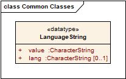
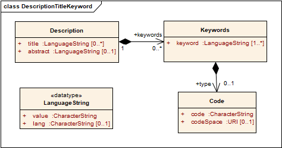
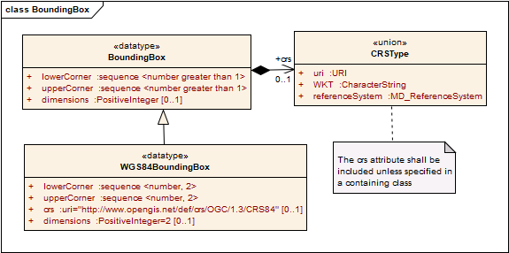

[[conventions]]
== Conventions

This section provides details and examples for any conventions used in the document. Examples of conventions are symbols, abbreviations, use of XML schema, or special notes regarding how to read the document.

[[identifiers]]
=== Identifiers

The normative provisions in this specification are denoted by the URI

http://www.opengis.net/spec/TileMatrixSet/1.0

All requirements and conformance tests that appear in this document are denoted by partial URIs which are relative to this base.

[[commonClasses]]
=== Common Classes

The following classes are extracted from the OWS Common 06-121r9. This way, the data structures presented in this document become independent form OWS Common and can be used in the emerging OGC APIs that depends on OGS API Commons (avoiding a conflicting dependency with OWS Common)

==== Multilingual text encoding
Some text parameters specified with the data type CharacterString in UML are intended to have human-readable values, but not all humans can understand the same languages. This data class can be latter mapped to XML encoding or JSON.

The specified approach to allowing the language of a text value to be explicitly stated is indicated by the UML class diagram in the figure.

[#img_languagestring-uml-model,reftext='{figure-caption} {counter:figure-num}']
.LanguageString UML model

The value parameter specifies the human-language string, and the lang parameter specifies the language (in IETF RFC 4646 syntax) of the string. If a lang parameter is not present, then no language has been specified for the string unless specified by another means.

NOTE: OGC APIs will use the language negotiation with HTTP headers. In this situation it is expected that LanguageString will default into a CharacterString that in JSON will default into a string data type. This does not preclude that in other environments the JSON encodings for Language string can implement the LanguageString. In practice this means that a JSON schema for a LanguageString element should support both string and Language string types.

==== Description, Title and Keywords
A basic set of data description parameters that includes human-readable title, abstract, and keywords is widely used in this standard and defined here as UML.

[#img_description-title-keyword-uml-model,reftext='{figure-caption} {counter:figure-num}']
.Description Title Keywords UML model

[#parts-of-descriptiontitlekeyword-elements,reftext='{table-caption} {counter:table-num}']
.Parts of Description Title Keyword data elements
[width = "100%",options="header"]
|===
| Names | Definition | Data type and values | Multiplicity and use
|
title ^a^

Title | Title of this tile matrix set, normally used for display to a human | LanguageString data structure | Zero or more (optional) Include when available and useful

Include one for each language represented ^f^
| abstract ^a^

Abstract | Brief narrative description of this tile matrix set, normally available for display to a human | LanguageString data structure | Zero or more (optional) Include when available and useful

Include one for each language represented
| keywords^a^

Keywords | Unordered list of one or more keywords | MD_Keywords class in ISO 19115 | Zero or more (optional)

One for each keyword authority used (one for each 'type' value)
4+|
^a^     The multilingual scoping rules apply.
|===

keywords is described from MD_Keywords class in ISO 19115 and has a list of keyword of the same 'type' specified in the optional 'type' element,

[#parts-of-descriptiontitlekeyword-elements,reftext='{table-caption} {counter:table-num}']
.Parts of Description Title Keyword data elements
[width = "100%",options="header"]
|===
| Names | Definition | Data type and values | Multiplicity and use
|
keyword^a^

Keyword | Unordered list of one or more commonly used or formalized word(s) or phrase(s) used to describe this dataset | LanguageString data structure | One or more (optional)
| type

Type | Type of the keyword | CodeType, as adaptation of MD_Identifier class ISO 19115 | Zero or one (optional)
4+|
^a^     The multilingual scoping rules apply.
|===

==== BoundingBox
A (basic) bounding box is one type of bounding box that is used in this document. Bounding box data structure specified in the following UML model and table.

The BoundingBox class describes a Minimum Bounding Rectangle (MBR) surrounding a feature (in the broader sense), in the supported CRS.

A WGS 84 bounding box is another type of bounding box. This type is simplified from the basic bounding box data type for use only with the 2D geographic coordinate reference system which uses the WGS 84 geodetic datum, where longitude precedes latitude and both are recorded in decimal degrees.

[#img_boundingbox-uml-model,reftext='{figure-caption} {counter:figure-num}']
.BoundingBox UML model

[#parts-of-boundingbox-data-structure,reftext='{table-caption} {counter:table-num}']
.Parts of BoundingBox data structure
[width = "100%",options="header"]
|===
| Names | Definition | Data type and values | Multiplicity and use
| lowerCorner | Coordinates of bounding box corner at which the value of each coordinate normally is the algebraic minimum within this bounding box ^a^
| Ordered sequence of double values ^b^
| One (mandatory)
| upperCorner | Coordinates of bounding box corner at
which the value of each coordinate
normally is the algebraic maximum
within this bounding box ^a^
| Ordered sequence of double values ^b^
| One (mandatory)
| CRS | Reference or a definition of the CRS used by the LowerCorner and UpperCorner coordinates  | CRStype | Zero or one (optional)
Include unless referenced elsewhere
| dimension | The number of dimensions in this CRS (the length of a coordinate sequence)  | Positive integer | Zero or one (optional) ^c^
4+| ^a^  Values other than the minimum and maximum may be used as discussed below.

^b^  The number of axes included, and the order of these axes, as specified by the referenced CRS.

^c^  This number is specified by the referenced CRS definition, but may also be specified here.
|===

The bounding box contents defined will not always specify the MINIMUM rectangular BOUNDING region, if the referenced CRS uses an Ellipsoidal, Spherical, Polar, or Cylindrical coordinate system, as those terms are specified in OGC Abstract Specification Topic 2. Specifically, this box will not specify the minimum rectangular bounding region surrounding a geometry whose set of points span the value discontinuity in an angular coordinate axis. Such axes include the longitude and latitude of Ellipsoidal and Spherical coordinate systems. That geometry could lie within a small region on the surface of the ellipsoid or sphere.

If the data for which a bounding box is needed is continuous around the continuous angular axis of an Ellipsoidal, Spherical, Polar, or Cylindrical coordinate system, the bounding box limits for that angular axis shall be set to minus and plus infinity.

==== CRSType

In this version of this standard we introduce the possibility define a CRS using a full description in addition to a reference to an external CRS catalogue. For descendent compatibility, CRSType can be defaulted as a URI but in here we propose to extend it to union of three possibilities.

[#parts-of-crs-type-union,reftext='{table-caption} {counter:table-num}']
.Parts of CRSType data structure
[width = "100%",options="header"]
|===
| Names | Definition | Data type and values
| uri | A reference to a CRS | URI
| WKT | A string defining the CRS using Well Known Text | CharacterString
| referenceSystem | a reference system data structure as defined in the MD_ReferenceSystem of the ISO 19115 | MD_ReferenceSystem data type
|===
