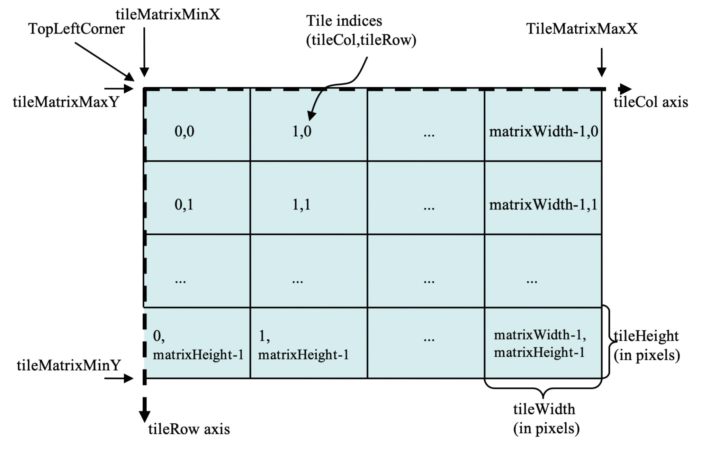
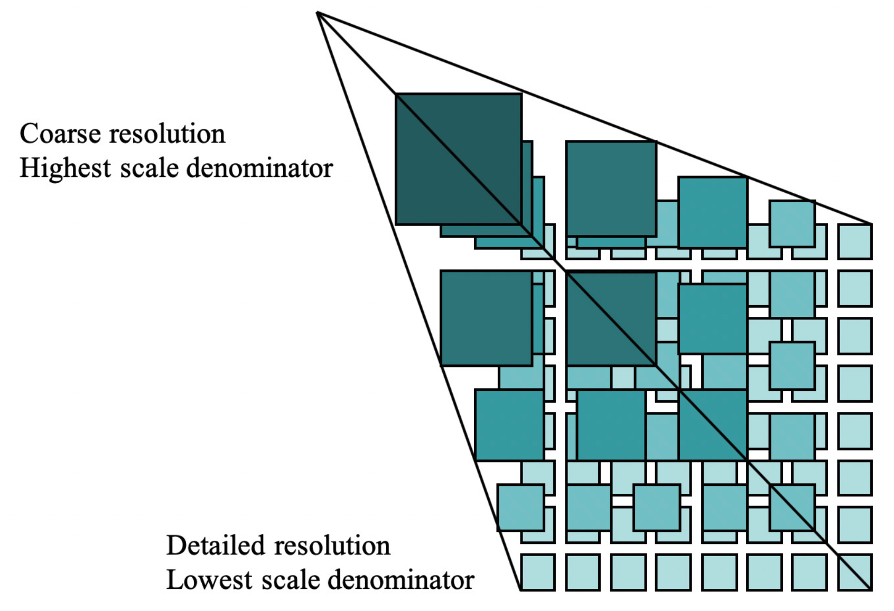
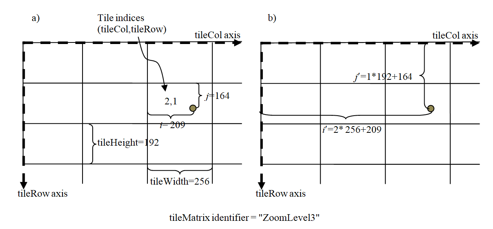
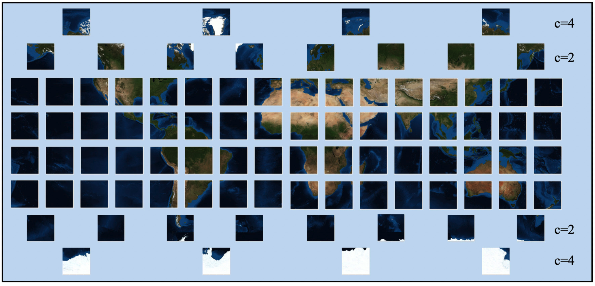
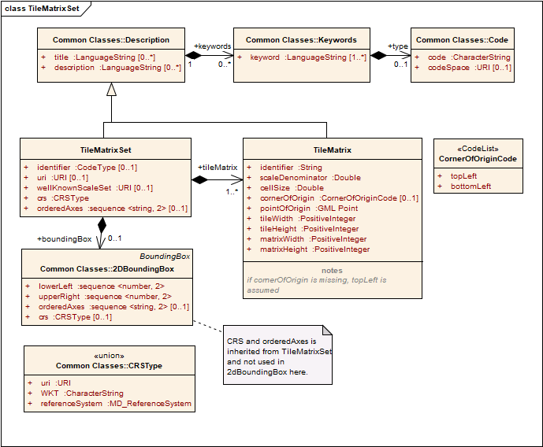

[[tile-matrix-set-concept]]
== TileMatrixSet

=== Overview

As stated in [OGC 08-015r4] Abstract Specification Topic 2: Referencing by Coordinates, a coordinate system is a set of mathematical rules for specifying how coordinates are to be assigned to points in space. A CRS is a coordinate system that is related to the real world by a reference datum. An example of mathematical rules is the application of a sphere or an ellipsoid centered in the datum and the use of a projection to transform the sphere or the ellipsoid into a planar representation of the world. Usually, the resulting planar coordinates are expressed as real numbers that are distances to the origin of the projection. This section introduces a tile scheme called Tile Matrix Set that is defined on top of a CRS. A fundamental part of the definition of a Tile Matrix Set is the Tile Matrix.

[[tile-matrix]]
==== Tile Matrix

A _Tile Matrix_ tile set defined by a tile scheme based on a regular tessellation of a 2D planar surface that follows a regular grid coverage. For the [OGC 09-146r6] CIS GeneralGridCoverage, the domain set of a grid describes the direct positions in multi-dimensional coordinate space, depending on the type of grid. In a grid-regular coverage, simple equidistant grids are established. When a grid-regular coverage is used to represent the world, the space becomes discrete in each dimension of the grid _domain range_. One possible discrete subdivision is the use of multidimensional _grid cells_. Another is to divide the domain into regular intervals that can be assigned to integer numbers that enumerate and identify _tiles_. This grid of tiles domain range can be defined by:

[loweralpha]
. The point of origin and corner of origin in a two-dimensional space of the bounding box of regular grid coverage (e.g., the CRS coordinates of the top left corner of the top left extreme where the integer coordinates are 0). This is the tile set origin that defines where the spatial origin reference point is for the entire tile set.
. A tile size in CRS units for in each dimension of the CRS; and
. The size of the tile matrix in tile units (i.e., number of tiles) that closes the bounding box of the tiled space. Frequently the sizes of the two first dimensions are called _matrix width_ and _matrix height_.

[[tile-matrix-in-a-two-dimensional-space.]]
===== Tile matrix in a two-dimensional space.

Two main use cases can be defined for tiles: storage and visualization. When Tiles are rendered in visualization devices that have the space quantized in pixels characterized by a size the concept of scale emerges. Then, the tile size in CRS units of the first two spatial dimensions and the size of the visualization device pixels become related. The two spatial dimensions are aligned with the pixel axes of the device.

In raster tiles, a second regular grid that is coincident with the tile matrix but denser (with smaller cell size but an exact submultiple of that size) is defined. Each grid cell of this new higher resolution grid is called a _grid cell_. The grid cells are defined by equally dividing the original tiles into __grid cells __using the __number of rendering cells in a tile__ (_tile width_ and _tile height_). In common tiled 2D visualization clients, a part of the _grid cell_ is made coincident with the device pixels and this part of the grid is rendered in the device: the second grid is named here as the _extrapolated_ _device grid_. In other words, a tile is divided in a number of cells in each dimension of the CRS in a way that creates cells that will become the exact same size of the pixels of a visualization device during visualization. The relation between both sizes is a function of the following two parameters:

[loweralpha]
. A scale (expressed as a scale denominator) and

. A grouping __of rendering pixels__ in a tile forming the tile. Common grouping values are 256x256 or 512x512. Frequently the sizes of the two first dimensions are called _tile width_ and _tile height_.

NOTE: Commonly _tile width_ and _tile height_ are equal but this constraint is not imposed by this Standard.

Since services cannot predict the pizel size of the client visualization device, in this Standard, the scale denominator is defined with respect to a "standardized rendering pixel size" of 0.28 mm × 0.28 mm (millimeters). The definition is the same as used in Web Map Service WMS 1.3.0 [OGC 06-042] and in Symbology Encoding (SE) Implementation Specification 1.1.0 [OGC 05-077r4] that was later adopted by WMTS 1.0 [OGC 07-057r7]. Frequently, the true pixel size of the device is unknown and 0.28 mm was the actual pixel size of a common display from 2005. This value is still being used as reference, even if current display devices are built with much smaller pixel sizes.

NOTE: Since the 1980s, the Microsoft Windows operating system has set their default standard display pixels per inch (PPI) to 96. This value results in an approximated 0.264 mm per pixel. The similarity of this value with the actual 0.28 mm adopted in this Standard can create some confusion.

NOTE: Modern display devices (screens) have pixels so small that operating systems allow for defining a presentation scale factor bigger than one (e.g. 150%). In these circumstances, the actual size of the device pixels are not the same as the size used by the operating system.

Normally the _matrix width_ is constant and in this circumstance, having a single scale factor using a single standardized rendering cell size for the two dimensions, results in cells that have the same size in the first two dimensions. This is commonly known as _square pixels_.

NOTE: The geometry above is different from WMS, which does allow non-square pixels (although many implementations fail to support non-square pixels properly).

NOTE: In rendered tiles, it is common that the range set represents colors of the cells and is stored in PNG or JPEG files of exactly one tile. Nevertheless, nothing prevents storing other kinds of values in other formats, such as TIFF files.

Tiled vector data also make use of the _extrapolated_ _device grid_, where the tiles are rendered for visualization purposes.

NOTE: Some tiled vector data expressed in formats such as GeoJSON do not make use of an _extrapolated device grid_. Other tiled formats (e.g., MBTiles) define an internal coincident grid denser than the _extrapolated_ __device grid__ and express the position using indices in this denser grid instead of coordinates.

For the case of a two-dimensional space, given the top left point of the tile matrix in CRS coordinates (tileMatrixMinX, tileMatrixMaxY), the width and height of the tile matrix in tile units (matrixWidth, matrixHeight), the __rendering cells in a tile__ values (tileWidth, tileHeight), the coefficient to convert the coordinate reference system (CRS) units into meters (metersPerUnit), and the scale (1:scaleDenominator), the bottom right corner of the bounding box of a tile matrix (tileMatrixMaxX, tileMatrixMinY) can be calculated as follows:

__cellSize = scaleDenominator__ × 0.28 10^-3^ / __metersPerUnit(crs)__

__tileSpanX = tileWidth__ × __cellSize__

__tileSpanY = tileHeight__ × __cellSize__

__tileMatrixMaxX = tileMatrixMinX__ + __tileSpanX__ × __matrixWidth__

__tileMatrixMinY = tileMatrixMaxY__ - __tileSpanY__ × __matrixHeight__

NOTE: In a CRS with coordinates expressed in meters, __metersPerUnit(crs)__ equals 1.

NOTE: In CRS with coordinates expressed in degrees __metersPerUnit(crs)__ equals 360/(__EquatorialRadius__*2*PI) (360 degrees are equivalent to the EquatorialPerimeter). E.g for WGS84 __metersPerUnit(crs)__ is 111319.4908 meters/degree.

The tile space therefore looks like this:

[#img_tile-space,reftext='{figure-caption} {counter:figure-num}']
.Tile Space (the corner of origin is topLeft)

Each tile in a tile matrix is identified by its __tileCol__ and __tileRow__ indices that have their 0,0 origin in one of the corners of the tile matrix. When the topLeft corner is used, __tileCol__ increases towards the right and __TileRow__ towards the bottom, as shown in Figure 1 (bottomLeft corner can also be used as origin making __TileRow__ increase towards the top). <<pseudocode-informative>> includes pseudocode that illustrates the process for obtaining the tile indices that cover a bounding box rectangle and also the computation to get the CRS coordinates that bound a tile.

NOTE: A tile matrix can be implemented as a set of image files (e.g., PNG or JPEG) in a file folder, each file representing a single tile

NOTE: Section 6 of the TIFF specification v6 defines 2D tiles in the same way that has been done in this standard. All tiles in a tile matrix can be stored in a single TIFF file. The TIFF file includes only one set conterminous tiles sharing a common single scale.

[[tile-matrix-set]]
==== Tile Matrix Set

Depending on the range of scales needed to be represented in the screen of a client, a single tile matrix is impractical and might force the software to spend too much time simplifying/generalizing the dataset prior to rendering.

Commonly, several tile matrices are progressively defined covering the expected ranges of scales needed for the application. A _Tile Matrix Set_ is a tile scheme composed of a collection of tile matrices, optimized for a particular scale and identified by a tile matrix identifier. Each Tile Matrix Set has an optional approximated bounding box, but each tile matrix has an exact bounding box that is deduced indirectly from other parameters. Tile matrix bounding boxes at each scale will usually vary slightly due to their cell alignment.

[#img_tile-matrix-set-representation,reftext='{figure-caption} {counter:figure-num}']
.Tile Matrix Set representation

A Tile Matrix has a unique alphanumeric identifier in the Tile Matrix Set. Some tile-based implementations prefer to use a _zoom level_ number or level of detail designation (LoD)  which has the advantage of suggesting some order in the list of tile matrices. This Standard does not use the _zoom level_ concept but, to ease adoption of this standard in implementations that prefer numeric zoom levels, many Tile Matrix Sets defined in <<annex-common-tilematrixset-definitions-informative>> use numbers as Tile Matrix identifiers. In this case, the index order in the list of tile matrices defined in a Tile Matrix Set could still be used as a _zoom level ordering_ internally.

In some other standards, the tile matrix set concept is called an _image pyramid,_ like in clause 11.6 of the OGC KML 2.2 [OGC 07-147r2] standard.  JPEG2000 (ISO/IEC 15444-1) and JPIP (ISO/IEC 15444-9) also use a similar division of the space called _resolution levels_. Nevertheless, in those cases the pyramid is self-defined starting from the more detailed tile matrix (that uses square tiles), and constructing tiles of the next scales by successively aggregating 4 tiles of the previous scale, and so on (see Figure 2), and interpolating each 4 contiguous values of the previous scale into one in the next scale. That approach involves a more rigid structure which has scales related by powers of two and tiles that perfectly overlap tiles on the inferior scale denominators. Tile Matrix Sets presented in this document are more flexible, but KML _superoverlays_ or JPEG2000-based implementations can use this standard with some extra rules to describe their tile matrix sets. This document describes some tile matrix sets with scale sets related by powers of two in the <<annex-common-tilematrixset-definitions-informative>>.

Each of the WMTS procedure-oriented architectural style operations and resource-oriented architectural style resources are described in more detail in subsequent clauses in this standard.

NOTE: Clients and servers have to be careful when comparing floating numbers with tolerance (double precision, 16-digit numbers, have to be used).

[[well-known-scale-sets]]
==== Well-known scale sets

When overlaying and presenting tiles encoded in different tile matrix sets that do not have common sets of scale denominators and the same CRS in an integrated client, rescaling or re-projecting tiles to the common scale of the view might require re-sampling calculations that result in visual quality degradation.

The recommended way to prevent this problem is make use of the same global tile matrix set. For example, one of those available in <<common-tilematrixset-definitions-informative>>. If the geographic extent of the data covers only a part of the tile matrix set area, the __tile matrix limits__ element of the tileset metadata can be used to inform about these limitations.

If using the same tile matrix set is not possible, using a common CRS and a common set of scales shared by as many layers and services as possible can also be a solution. Thus, the concept of well-known scale set (WKSS) is introduced.

Note that a WKSS only defines a small subset of what is needed to completely define a Tile Matrix Set. A WKSS is an optional feature that does not replace the need to define the Tile Matrix Set and its Tile Matrices. The original purpose of WKSS is no longer necessary if services share and reference common Tile Matrix Set definitions such as the ones in <<common-tilematrixset-definitions-informative>>.

A WKSS is a commonly used combination of a CRS and a set of scales. A tile matrix set can declare support for a WKSS set by referencing that WKSS. A client application can confirm that tiles in one tile matrix set are compatible with tiles in another tile matrix set merely by verifying that they declare a common WKSS. The informative <<annex-c-well-known-scale-sets-informative>> provides several WKSSs (and others could be incorporated in the future).

A tile matrix set conforms to a particular WKSS when it uses the same CRS and defines all scale denominators ranging from the largest scale denominator in the WKSS to some low scale denominator (in other words, it is not necessary to define all the lower scale denominators to conform to a WKSS).

[[tile-based-coordinates-in-a-tile-matrix-set]]
==== Tile based coordinates in a tile matrix set

A tile in a tile-based coordinate can be referred by its tile position in the tile matrix dimensions and the tile matrix identifier in tile matrix set. In a two-dimensional space, a tile is identified by these 3 discrete index names: _tile row_, _tile column_ and _tile matrix identifier_.

In raster tiles, a grid cell in the _extrapolated_ _device grid_ domain set can be identified by a set of floating point coordinates in the CRS and by one of two ways that does not present rounding issues, as follows.

* By the tile indices the grid cell is contained by (referred by its tile position in the tile matrix dimensions and the Tile Matrix identifier in the Tile Matrix Set) and the cell indices inside the tile (_i_,_j_,…). In a two-dimensional space, a tile is identified by 5 discrete indices that are named: _tile row_, _tile column_, _tile matrix identifier_, _i_ and _j_. This is how GetFeatureInfo works in WMTS. This set of coordinates is called “_tile_ coordinates.”

* By the position of the cell in grid defined by the _extrapolated_ _device grid_ domain set (that starts at the top left corner of the tiled space) of the tile matrix and the identifier of the Tile Matrix in Tile Matrix Set. In a two-dimensional space, a grid cell is identified by 3 discrete indices that are named: _i_, _j_ and _tile matrix identifier_. Note that _i_ and _j_ can be very big integer numbers and, for very detailed scale, tile matrices might require integer 64-bit notation if stored as binary numbers. This set of indices is called “_tilematrix_ coordinates.”

[#img_tile_coordinates,reftext='{figure-caption} {counter:figure-num}']
.Tile coordinates (a) and Tile matrix coordinates (b) to identify grid cells

[[variable-matrixwidth-tile-matrix]]
==== Variable width tile matrices

Until now, it has been assumed that __matrixWidth__ is constant for all tile rows. This is common usage for projections that do not distort the Earth too much. But when using Equirectangular Plate Carrée projection (see <<common-tilematrixset-definitions-informative>> subsection 2) the distortion increases for tiles closer to the poles. In the extreme, the upper row of the upper tile (the one representing the North Pole) contains a list of repeated values that represents almost the same position in the space. The same can be said for the lower row of the lower tile (the one representing the South Pole). When the tiles are represented in a flat projection, this is an effect that cannot be avoided, but when the data are presented in a virtual globe, the distortion results in redundant information in the poles that need to be eliminated by the client during the rendering. Compensating for distortion is better done at the server side instead.

The solution consists of reducing the number of tiles (__matrixWidth__) in the high latitude rows and generating those tiles with a compressed scale in the _i_ dimension (see Figure 5). To allow this solution, the tile model must be extended to specify coalescence coefficients (c) that reduce the number of tiles in the width direction by aggregating c horizontal tiles but keeping the __tileWidth__ (and __tileHeight__). The coalescence coefficient is not applied next to the Equator but is used in medium and high latitudes (the higher the latitude the larger the coefficient).

Even if tiles can coalesce, this does not change the indexing or the tile matrix set that will be the same as if no coalescence has been applied. For example, if the c coefficient is 4, the __tileCol__ of the first tile will be 0, the __tileCol__ of the second tile will be 4, the __tileCol__ of the third tile will be 8 and so on. In other words, and for the same example, __tileCol__ 0, 1, 2 and 3 points to the same tile.

NOTE: This solution is necessary to still be able to define a rectangle in the space based on tile indices as we do in the <<tilematrixsetlimits-requirements-class>>.

[#img_tilematrix-with-variable-matrix-width,reftext='{figure-caption} {counter:figure-num}']
.TileMatrix with variable matrix width

[[tilematrixset-requirements]]
=== TileMatrixSet Requirements Classes

[[tilematrixset-requirements-class]]
==== TileMatrixSet requirements class

Requirements class tilematrixset establishes how to describe a TileMatrixSet for a two-dimensional tile space. The expectation is that tile matrix sets are defined once and that servers or encodings using or distributing tiles will declare the usage of a tile matrix set by linking to that tile matrix set.

include::requirements/requirements_tilematrixset.adoc[]

include::requirements/tilematrixset/REQ_tilematrixset_model.adoc[]

[#img_tilematrixset-uml-model,reftext='{figure-caption} {counter:figure-num}']
.TileMatrixSet UML model

<<parts-of-tilematrixset-data-structure>> defines the structure of the TileMatrixSet.

[#parts-of-tilematrixset-data-structure,reftext='{table-caption} {counter:table-num}']
.Parts of TileMatrixSet data structure
[width = "100%",options="header"]
|===
| Names | Definition | Data type and values | Multiplicity and use
| identifier | Tile matrix set identifier ^g^ | CodeType, as adaptation of MD_Identifier class ISO 19115 | Zero or One (optional)
| title ^a^ | Title of a tile matrix set, normally used for display to a human | LanguageString data structure. See <<parts-of-descriptiontitlekeyword-elements>> | Zero or more (optional) Include when available and useful

Include one for each language represented ^f^
| description ^a^ | Brief narrative description of a tile matrix set, normally available for display to a human | LanguageString data structure. See <<parts-of-descriptiontitlekeyword-elements>> | Zero or more (optional) Include when available and useful

Include one for each language represented
| keywords^a^ | Unordered list of one or more commonly used or formalized word(s) or phrase(s) used to describe a tile matrix set | MD_Keywords class in ISO 19115. See <<parts-of-descriptiontitlekeyword-elements>> | Zero or more (optional)

One for each keyword authority used
| uri | Reference to an official source for a tile matrix set | URI type | Zero or One (optional) Include when an official source exists

| crs | Coordinate Reference System (CRS)^j^ | CRSType type, see <<parts-of-crs-type-union>> | One (mandatory) ^i^

| orderedAxes | Ordered list of names of the dimensions defined in the CRS^k^ | Ordered sequence of strings | Zero or one (optional)

| wellKnownScaleSet | Reference to a well-known scale set ^e^ | URI type ^h^ | Zero or one (optional) ^c^

| boundingBox | Minimum bounding rectangle surrounding the tile matrix set, in the CRS ^b^ | 2DBoundingBox data structure, see <<parts-of-boundingbox-data-structure>> | Zero or one (optional)

| tileMatrix | Description of a scale level and its tile matrix | TileMatrix data structure. See <<parts-of-tilematrix-data-structure>> | One or more (mandatory) ^d^
4+|
^a^     The multilingual scoping rules in <<multilingualTextEncoding>> apply.

^b^     In the same CRS as the TileMatrixSet. boundingBox should be considered informative about the area covered by this TileMatrixSet. It SHOULD NOT be used to calculate the position of the tiles in the CRS space. Instead use the cornerOfOrigin and the pointOfOrigin of the corresponding TileMatrix. If data is not available for the entire tiled space, TileMatrixSetLimits will declare what tiles have data (see <<tilematrixsetlimits-requirements-class>>).

^c^     When a tile matrix set conforms to a well-known scale set, it can reference it by its URI. If used, the well-known scale set SHALL be consistent with the CRS and with the scaleDenominators of the tileMatrix parameters.

^d^     Commonly more than one. Each tileMatrix of a tileMatrixSet SHALL have a unique (different) scaleDenominator.

^e^     Some possible values are defined the in <<annex-well-known-scale-sets-informative>>.

^f^     If no Title is specified, a client may display the Identifier value instead.

^g^     TileMatrixSet identifies SHALL be unique (different) for each TileMatrixSet of a server.

^h^     In WMTS 1.0 a URN was used as a reference to a well-known scale set. Later, OGC adopted HTTP URLs as URIs for references. The (https://docs.opengeospatial.org/pol/09-046r5.html#_naming_rule)[OGC Naming Authority - Procedures document] specifies rules to transform form URN to URI. Implement a on-the-fly translations based on these rules is possible.

^i^     In some cases where high precision is required, the use of precise realizations of the same CRS is needed or the CRS is dynamic (varies slightly with time) and needs to be accompanied by an epoch. For this data structure, a TileMatrixSet is defined by the generic CRS name. The CRS realization and epoch used by a concrete tileset is specified in the tileset metadata. In most of the cases, tilesets sharing the same generic CRS overlap but for some high precise applications and for very fine grained scales, a client can perform run-time corrections to accurately overlay tilesets based on that information, or alternatively refuse to overlap tilesets not having the same CRS realization or epoch.

^j^     The CRS of the TileSets using this TileMatrixSet should be compatible with this CRS. See <<TileMatrixSetCRSCompatibility>>

^k^     This element is not intended to overwrite the CRS axis order but to make it visible to developers by repeating information that is already contained in the CRS definition.
|===

In addition to a general tile matrix set description, an array of tile matrix elements is needed to define the distribution of tiles for each scale denominator.
[#parts-of-tilematrix-data-structure,reftext='{table-caption} {counter:table-num}']
.Parts of TileMatrix data structure
[width = "100%",options="header"]
|===
| Names | Definition | Data type and values | Multiplicity and use
| identifier |
Tile matrix identifier ^c^
 |
ows:CodeType, as adaptation of MD_Identifier class ISO 19115
 |
One (mandatory)

| title ^a^ |
Title of a tile matrix, normally used for display to a human
 |
LanguageString data structure. See <<parts-of-descriptiontitlekeyword-elements>>
 |
Zero or more (optional) Include when available and useful

Include one for each language represented ^d^

| description ^a^ |
Brief narrative description of a tile matrix, normally available for display to a human
 |
LanguageString data structure. See <<parts-of-descriptiontitlekeyword-elements>>
 |
Zero or more (optional) Include when available and useful

Include one for each language represented

| keywords ^c^ |
Unordered list of one or more commonly used or formalized word(s) or phrase(s) used to describe a tile matrix
 |
MD_Keywords class in ISO 19115. See <<parts-of-descriptiontitlekeyword-elements>>
 |
Zero or more (optional)

One for each keyword authority used

| scaleDenominator | Scale denominator of a tile matrix ^f^ | Double type | One (mandatory)

| cellSize | Cell size of a tile matrix ^f^ | Double type | One (mandatory)

| cornerOfOrigin |
Corner of the tile matrix used as the origin for numbering tile rows and columns.
 |
enumeration. See <<parts-of-corner-of-origin-enum>>
 |
Zero or one (optional). Default value is "topLeft"

| pointOfOrigin ^e^ |
Position in CRS coordinates of the corner of origin for a tile matrix.
 |
GM_Point data structure ^b^
 |
One (mandatory)

| tileWidth |
Width of each tile of a tile matrix in cells
 |
Positive integer type
 |
One (mandatory)

| tileHeight |
Height of each tile of a tile matrix in cells
 |
Positive integer type
 |
One (mandatory)

| matrixWidth |
Width of the matrix (number of tiles in width)
 |
Positive integer type
 |
One (mandatory)

| matrixHeight |
Height of the matrix (number of tiles in height)
 |
Positive integer type
 |
One (mandatory)
4+|
^a^    The multilingual scoping rules in <<multilingualTextEncoding>> apply.

^b^    As specified in the ISO 19107. The CRS and order of these coordinates shall be as specified by the _crs_ of the parent TileMatrixSet. These are the precise coordinates of the corner of origin (e.g. the top-left corner) for the tile matrix, which is also the corner of the (0, 0) tile. See Figure 1.

^c^    These TileMatrix identifiers SHALL be unique (different) within the context of the parent TileMatrixSet. Many applications use a correlative numeric value as an identifier. Other alternatives are a rounded scale denominator or a rounded cell size. Repeating the TileMatrixSet identifier as part of the TileMatrix identifier should be avoided.

^d^    If no Title is specified, clients may display the Identifier value instead.

^e^    In previous versions this attribute was called topLeftCorner and the concept of cornerOfOrigin did not exist

^f^    The cell size of the tile can be obtained from the scaleDenominator by multiplying the latter by 0.28 × 10-3 / metersPerUnit. If the CRS uses _meters_ as units of measure for the horizontal dimensions, then metersPerUnit=1; if it uses degrees, then metersPerUnit=2*pi__a__/360 (_a_ is the Earth maximum radius of the ellipsoid; a.k.a the radius of the equator.).
|===
 

NOTE: It may be desirable to define a tile matrix set with some general-scale tile matrices in one CRS (_e.g._, CRS:84) and with detailed-scale tile matrices in a different CRS (_e.g._, LCC projection). However, this standard does not allow mixing CRSs. Each tile matrix set declares a single CRS.

NOTE: The width (matrixWidth) and height (matrixHeight) in tiles of each tile matrix is explicitly given, so the range of relevant tile indexes does not have to be calculated by the client application.

NOTE: The bounding box of a tile matrix is not supplied explicitly because it can be calculated from cornerOfOrigin, pointOfOrigin, tileWidth, tileHeight and scaleDenominator.

[#parts-of-corner-of-origin-enum,reftext='{table-caption} {counter:table-num}']
.Parts of CornerOfOriginCode enumeration
[width = "100%",options="header"]
|===
| Names | Definition
| topLeft | Top left corner ^a^
| bottomLeft | Bottom left corner ^b^
2+|
^a^    The only possibility available in WMTS 1.0. Sometimes known as "xyz" in other non OGC specifications.

^b^    Used by Tile Map Service. Sometimes known as "tms" in other non OGC specifications
|===

[[TileMatrixSetCRSCompatibility]]
===== TileMatrixSet CRS Compatibility
In general, the CRS of the TileSets using a TileMatrixSet should be the same as the CRS of that TileMatrixSet. However there are some situations where there is some flexibility:

* The CRS of the TileSet is a realization of the datum ensemble CRS specified in the TileMatrixSet. E.g. TileSet CRS: EPSG:9057 (G1762 realization of WGS84) and TileMatrixSet CRS: EPSG:4326 (WGS84)
* The CRS of the TileSet includes additional dimensions beyond the 2 specified in the CRS of the TileMatrixSet. E.g. TileSet CRS: EPSG:4979 (lat, lon, h in WGS84) and TileMatrixSet CRS: EPSG:4326 (lat, lon in WGS84)
* The CRS of the TileSet and the CRS of the TileMatrixSet only differ in axes ordering. E.g. TileSet CRS: EPSG:4326 (lat, lon) and TileMatrixSet CRS: CRS84 (lon, lat). The order specified in the TileMatrixSet only affects the coordinates order for the PointOfOrigin and optional BoundingBox within the TileMatrixSet definition itself. The CRS of the TileSet affects the coordinates order for the data in the tiles, if applicable (e.g some formats of vector tiles)

[[variablematrixwidth-requirements-class]]
==== VariableMatrixWidth requirements class

This requirements class provides the necessary support for variable matrix width tile matrix sets.

include::requirements/requirements_variablematrixwidth.adoc[]

include::requirements/variablematrixwidth/REQ_variablematrixwidth_model.adoc[]

[#img_variablematrixwidth-uml-model,reftext='{figure-caption} {counter:figure-num}']
.VariableMatrixWidth UML model
image::figures/VariableMatrixWidth.png[VariableMatrixWidth UML model]

In order to make the description of the model more compact, only the tile rows that have coalesced (i.e., coalescence factor larger than 1) will be encoded.

[#parts-of-variablematrixwidth-data-structure,reftext='{table-caption} {counter:table-num}']
.Parts of VariableMatrixWidth data structure
[width = "100%",options="header"]
|===
| Names | Definition | Data type and values | Multiplicity and use
| coalesce | Coalescence factor | Positive integer type ^a^ | One (mandatory)
| minTileRow | First tile row where the coalescence factor applies for a tilematrix | Non negative integer type ^b^ | One (mandatory)
| maxTileRow | Last tile row where the coalescence factor applies for a tilematrix | Non negative integer type ^c^ | One (mandatory)
4+| ^a^    Shall be more than 1. Rows with Coalescence factor of 1 shall not be described here.

^b^    From 0 to maxTileRow.

^c^    From minTileRow to matrixWidth-1 of the tileMatrix section of the associated tileMatrixSet.
|===
 
include::requirements/variablematrixwidth/REQ_variablematrixwidth_coalescence1.adoc[]
