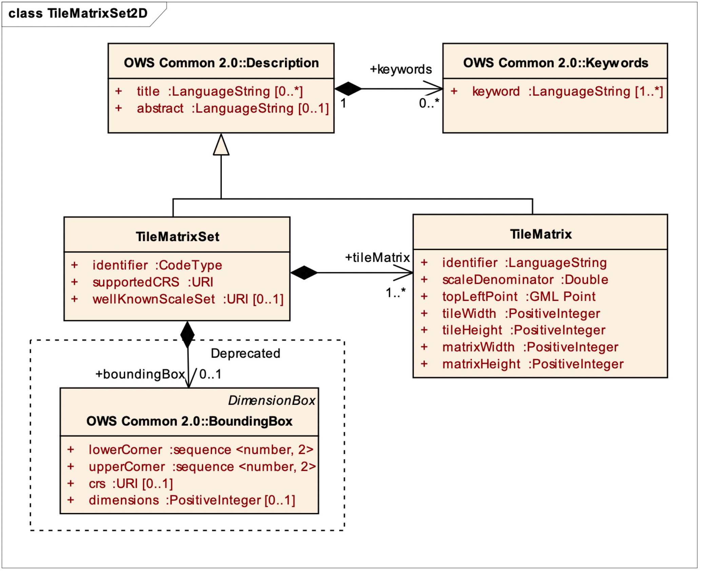
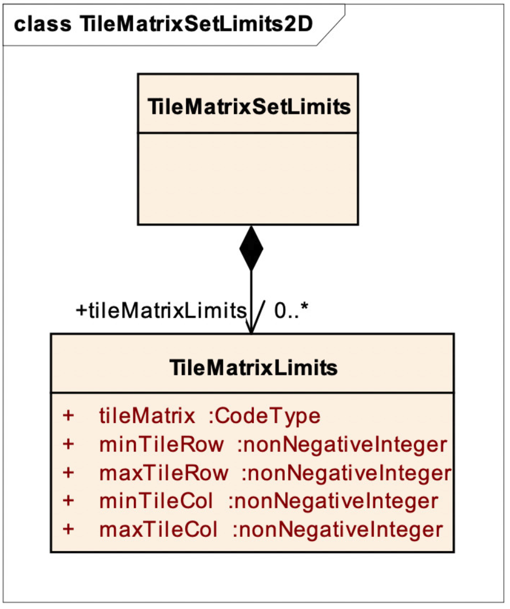
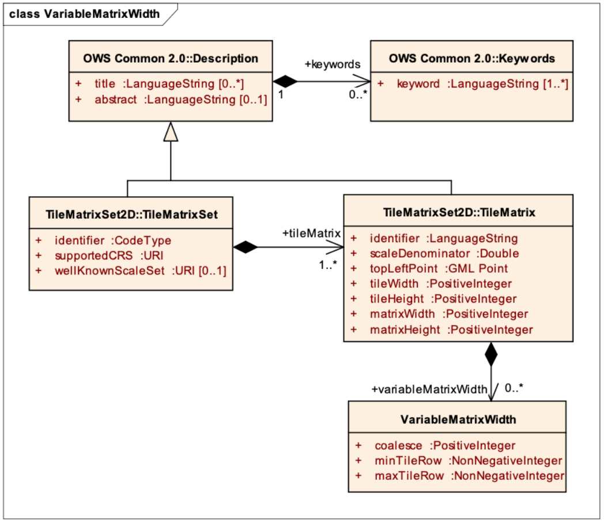
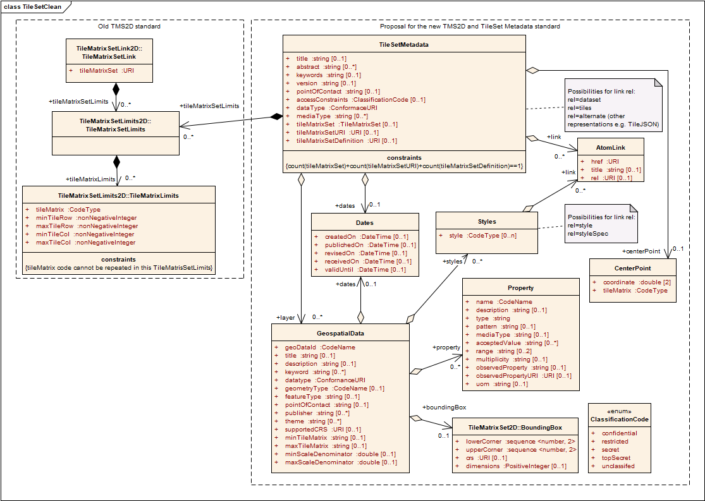

[[tilematrixset2d-model]]
== TileMatrixSet2D model

[[tilematrixset2d-requirements-class]]
=== TileMatrixSet2D requirements class

Requirements class tilematrixset2D establishes how to describe a TileMatrixSet for a two-dimensional tile space. It is expected that tile matrix sets are defined once and that servers or encodings using or distributing tiles will declare the usage of a tile matrix set by linking to that tile matrix set. The identifying URI for this class is http://www.opengis.net/spec/tilematrixset/1.1/req/tilematrixset2d.

include::requirements/REQ_tilematrixset2d_model.adoc[]

[#img_tilematrixset-uml-model,reftext='{figure-caption} {counter:figure-num}']
.TileMatrixSet UML model

<<parts-of-tilematrixset-data-structure>> defines the structure of the TileMatrixSet.

[#parts-of-tilematrixset-data-structure,reftext='{table-caption} {counter:table-num}']
.Parts of TileMatrixSet data structure
[width = "100%",options="header"]
|===
| Names | Definition | Data type and values | Multiplicity and use
| identifier

Identifier | Tile matrix set identifier ^g^ | ows:CodeType, as adaptation of MD_Identifier class ISO 19115 | One (mandatory)
|
title ^a^

Title | Title of this tile matrix set, normally used for display to a human | LanguageString data structure, see Figure 15 in OWS Common [OGC 06-121r9] | Zero or more (optional) Include when available and useful

Include one for each language represented ^f^
| abstract ^a^

Abstract | Brief narrative description of this tile matrix set, normally available for display to a human | LanguageString data structure, see Figure 15 in OWS Common [OGC 06-121r9] | Zero or more (optional) Include when available and useful

Include one for each language represented
| keywords^a^

Keywords | Unordered list of one or more commonly used or formalized word(s) or phrase(s) used to describe this dataset | MD_Keywords class in ISO 19115 | Zero or more (optional)

One for each keyword authority used
| bounding‌Box

Bounding‌Box | Minimum bounding rectangle surrounding the tile matrix set, in the supported CRS ^b^ | BoundingBox data structure, see subclause 10.2 of OWS Common [OGC 06-121r9] | Zero or one (optional)

| supported‌CRS

Supported‌CRS | Reference to one coordinate reference system (CRS) | URI type | One (mandatory)
| wellKnown‌ScaleSet

WellKnown‌ScaleSet | Reference to a well-known scale set^e^ | URI type | Zero or one (optional) ^c^
| tileMatrix

TileMatrix | Describes a scale level and its tile matrix | TileMatrix data structure, see Table Table 2 | One or more (mandatory) ^d^
4+|
^a^     The multilingual scoping rules in subclause 10.7.3 of OWS Common [OGC 06-121r9] SHALL apply.

^b^     Informative. boundingBox SHOULD NOT be used to calculate the position of the tiles in the CRS space; please use topLeftCorner of the corresponding TileMatrix instead. If data is not available for all tiled space, TileMatrixSetLimits will declare what the tiles have data (see section 7.2).

^c^     When a tile matrix set conforms to a well-known scale set it can reference it by its URI. If used, the well-known scale set SHALL be consistent with the supportedCRS and with the scaleDenominators of the tileMatrix parameters.

^d^     Commonly more than one. Each tileMatrix of a tileMatrixSet SHALL have a unique (different) scaleDenominator.

^e^     Some possible values are defined the in Annex C.

^f^     If no Title is specified, a client may display the Identifier value instead.

^g^     TileMatrixSet identifies SHALL be unique (different) for each TileMatrixSet of a server.
|===
 
The BoundingBox class describes a Minimum Bounding Rectangle (MBR) surrounding the tile matrix set, in the supported CRS.

[#parts-of-boundingbox-data-structure,reftext='{table-caption} {counter:table-num}']
.Parts of BoundingBox data structure
[width = "100%",options="header"]
|===
| Names | Definition | Data type and values | Multiplicity and use
| lowerCorner | Southern-most coordinate of the limit of the Tile Matrix Set extent | |
| upperCorner | Northern-most coordinate of the limit of the Tile Matrix Set extent | |
| CRS | Coordinate reference system | |
| dimension | The number of dimensions defined in the coordinate reference system | |
|===

[#parts-of-tilematrix-data-structure,reftext='{table-caption} {counter:table-num}']
.Parts of TileMatrix data structure
[width = "100%",options="header"]
|===
| Names | Definition | Data type and values | Multiplicity and use
| identifier

Identifier
 |
Tile matrix identifier ^c^
 |
ows:CodeType, as adaptation of MD_Identifier class ISO 19115
 |
One (mandatory)

| title ^a^

Title
 |
Title of this style, normally used for display to a human
 |
LanguageString data structure, see Figure 15 in OWS Common [OGC 06-121r9]
 |
Zero or more (optional) Include when available and useful

Include one for each language represented ^d^

| abstract ^a^

Abstract
 |
Brief narrative description of this style, normally available for display to a human
 |
LanguageString data structure, see Figure 15 in OWS Common [OGC 06-121r9]
 |
Zero or more (optional) Include when available and useful

Include one for each language represented

| keywords^c^

Keywords
 |
Unordered list of one or more commonly used or formalized word(s) or phrase(s) used to describe this dataset
 |
MD_Keywords class in ISO 19115
 |
Zero or more (optional)

One for each keyword authority used

| scale‌Denominator

Scale‌Denominator
 |
Scale denominator level of this tile matrix ^g^
 |
Double type
 |
One (mandatory)

| topLeft‌Corner

TopLeft‌Corner
 |
Position in CRS coordinates of the top-left corner of this tile matrix
 |
Ordered sequence of double values ^b^
 |
One (mandatory)

| tileWidth

TileWidth
 |
Width of each tile of this tile matrix in pixels
 |
Positive integer type
 |
One (mandatory)

| tileHeight

TileHeight
 |
Height of each tile of this tile matrix in pixels
 |
Positive integer type
 |
One (mandatory)

| matrix‌Width

Matrix‌Width
 |
Width of the matrix (number of tiles in width)
 |
Positive integer type
 |
One (mandatory)

| matrix‌Height

Matrix‌Height
 |
Height of the matrix (number of tiles in height)
 |
Positive integer type
 |
One (mandatory)
4+|
^a^    The multilingual scoping rules in subclause 10.7.3 of OWS Common [OGC 06-121r9] SHALL apply.

^b^    CRS will be inherited from the supportedCRS parameter of the parent TileMatrixSet. The order of these axes shall be as specified by the supportedCRS. These are the precise coordinates of the top left corner of top left pixel of the 0,0 tile. See Figure 1.

^c^    This TileMatrix identifiers SHALL be unique (different) within the context of the parent TileMatrixSet. Many applications use a correlative numeric value as an identifier. Other alternatives are a rounded scale denominator or a rounded pixel size. It is recommended to avoid repeating the TileMatrixSet identifier as part of the TileMatrix identifier.

^d^    If no Title is specified, client may display the Identifier value instead.

^e^    In XML schemas ows:PositionType data type is used. See OWS 2.0 schemas (owsCommon.xsd).

^g^    The pixel size of the tile can be obtained from the scaleDenominator by multiplying the later by 0.28 10-3 / metersPerUnit. If the CRS uses _meters_ as units of measure for the horizontal dimensions, then metersPerUnit=1; if it has degrees, then metersPerUnit=2p__a__/360 (_a_ is the Earth maximum radius of the ellipsoid).
|===
 

NOTE: It may be desirable to define a tile matrix set with some general-scale tile matrices in one CRS (_e.g._, CRS:84) and with detailed-scale tile matrices in a different CRS (_e.g._, LCC projection). However, this standard does not allow mixing CRSs. Each tile matrix set declares a single CRS.

NOTE: The width (matrixWidth) and height (matrixHeith) in tiles of each tile matrix is explicitly given, so the range of relevant tile indexes does not have to be calculated by the client application.

NOTE: The bounding box of a tile matrix is not supplied explicitly because it can be calculated from topLeftCorner, tileWidth, tileHeight and scaleDenominator.

[[tilematrixsetlimits2d-requirements-class]]
=== TileMatrixSetLimits2D requirements class

Requirements class tilematrixsetlimits2D establishes how to describe a TileMatrixSetLimits for a two-dimensional tile space. It is expected that tile matrix sets are defined in a general way (globally, if possible). Data structured in tiles could only be available in a region of in a subset of scales. This data structure allows for the declaration of a limited coverage of a tile matrix set. The identifying URI for this class is http://www.opengis.net/spec/tilematrixset/1.1/req/tilematrixsetlimits2d.

include::requirements/REQ_tilematrixsetlimits2d_model.adoc[]

[#img_tilematrixsetlimits-uml-model,reftext='{figure-caption} {counter:figure-num}']
.TileMatrixSetLimits UML model

 

[#parts-of-tilematrixsetlimits-data-structure,reftext='{table-caption} {counter:table-num}']
.Parts of TileMatrixSetLimits data structure
[width = "100%",options="header"]
|===
| Names | Definition | Data type and values | Multiplicity and use
| tileMatrix‌Limits

Tile‌Matrix‌Limits | Indices limits for this tileMatrix | TileMatrixLimits data structure, see <<parts-of-tilematrixlimits-data-structure>> | one or more (mandatory) ^a^
4+| ^a^       Multiplicity SHALL be the equal of inferior to multiplicity of tileMatrix of this tileMatrixSet. Each tileMatrix identifier shall be mentioned only once in this TileMatrixSetLimits. If a tileMatrix identifier is not mentioned, it should be interpreted as a tileMatrix that is not available.
|===
 

[#parts-of-tilematrixlimits-data-structure,reftext='{table-caption} {counter:table-num}']
.Parts of TileMatrixLimits data structure
[width = "100%",options="header"]
|===
| Names | Definition | Data type and values | Multiplicity and use
| tileMatrix

TileMatrix | Reference to a tileMatrix identifier | ows:CodeType, as adaptation of MD_Identifier class ISO 19115 ^a^ | One (mandatory)
| minTile‌Row

MinTile‌Row | Minimum tile row index valid for this layer.
 |
Non negative integer type ^b^
 |
One (mandatory)

| maxTile‌Row

MaxTile‌Row
 |
Maximim tile row index valid for this layer.
 |
Non negative integer type ^c^
 |
One (mandatory)

| minTile‌Col

MinTile‌Col
 |
Minimum tile column index valid for this layer.
 |
Non negative integer type ^d^
 |
One (mandatory)

| maxTile‌Col

MaxTile‌Col
 |
Maximim tile column index valid for this layer.
 |
Non negative integer type ^e^
 |
One (mandatory)
4+|
^a^    SHALL be an identifier to a tileMatrix section of this tileMatrixSet.

^b^    From 0 to maxTileRow.

^c^    From minTileRow to matrixWidth-1 of the tileMatrix section of this tileMatrixSet.

^d^    From 0 to maxTileCol.

^e^    From minTileCol to tileHeight-1 of the tileMatrix section of this tileMatrixSet.
|===
 

[[variablematrixwidth-requirements-class]]
=== VariableMatrixWidth requirements class

This extension provides the necessary support for variable matrix width tile matrix sets.

include::requirements/REQ_variablematrixwidth_model.adoc[]

[#img_variablematrixwidth-uml-model,reftext='{figure-caption} {counter:figure-num}']
.VariableMatrixWidth UML model

In order to make the description of the model more compact, only the tile rows that have coalesced (i.e., coalescence factor larger than 1) will be encoded.

[#parts-of-variablematrixwidth-data-structure,reftext='{table-caption} {counter:table-num}']
.Parts of VariableMatrixWidth data structure
[width = "100%",options="header"]
|===
| Names | Definition | Data type and values | Multiplicity and use
| coalesce

Coalesce | Coalescence factor | Positive integer type ^a^ | One (mandatory)
| minTile‌Row

MinTile‌Row | Minimum tile row index valid for this layer | Non negative integer type ^b^ | One (mandatory)
| maxTile‌Row

MaxTile‌Row | Maximum tile row index valid for this layer | Non negative integer type ^c^ | One (mandatory)
4+| ^a^    Shall be more than 1. Rows with Coalescence factor of 1 shall not be described here.

^b^    From 0 to maxTileRow.

^c^    From minTileRow to matrixWidth-1 of the tileMatrix section of this tileMatrixSet.
|===
 
include::requirements/REQ_variablematrixwidth_coalescence1.adoc[]

[[tilesetmetadata2d-requirements-class]]
=== TileSetMetadata requirements class

Requirements class tilesetmetadata2d establishes how to describe TileSet Metadata for a two-dimensional tile space. This data structure allows for a dataset declaring the use of a tile matrix set defined elsewhere and, if needed, a limited coverage for this tile matrix set, the list of geodata resources used to create the tileset and a recommended center point. Each TileSet in a dataset collection should declare the use of a tile matrix set using this data structure. The identifying URI for this class is http://www.opengis.net/spec/tilematrixset/1.1/req/tilesetmetadata2d.

include::requirements/REQ_tilesetmetadata2d_identifier.adoc[]

NOTE: To determine if two resources or datasets use the same TileMatrixSet, compare their TileMatrixSet identifier. Alternatively, compare TileMatrixSet definitions for an equivalency (a simple calculation can be performed to verify whether or not two given tile matrices are aligned).

NOTE: If the same TileMatrixSet is externally available in more than one format, it is recommended that the format selected is more close to the original document format.
 
include::requirements/REQ_tilesetmetadata2d_model.adoc[]

[#img_tilesetmetadata-uml-model,reftext='{figure-caption} {counter:figure-num}']
.TileSetMetadata UML model

[#parts-of-tilesetmetadata-data-structure,reftext='{table-caption} {counter:table-num}']
.Parts of TileSetMetadata data structure
[width = "100%",options="header"]
|===
| Names | Definition | Data type and values | Multiplicity and use
|
title ^a^

Title | Title of this tile matrix set, normally used for display to a human | LanguageString data structure, see Figure 15 in OWS Common [OGC 06-121r9] | Zero or more (optional) Include when available and useful

Include one for each language represented ^f^
| abstract ^a^

Abstract | Brief narrative description of this tile matrix set, normally available for display to a human | LanguageString data structure, see Figure 15 in OWS Common [OGC 06-121r9] | Zero or more (optional) Include when available and useful

Include one for each language represented
| keywords^a^

Keywords | Unordered list of one or more commonly used or formalized word(s) or phrase(s) used to describe this dataset | MD_Keywords class in ISO 19115 | Zero or more (optional)

One for each keyword authority used
| pointOfContact | Information that can be used to contact the authors or custodians for the Tile Set (free form, can be anything from an e-mail address to physical address and phone numbers) | LanguageString data structure, see Figure 15 in OWS Common [OGC 06-121r9] | Zero or more (optional)
| version | Version number for the Tile Set.  | |
| accessConstraints | Indication about the availability of the Tile Set that the user with access to the Tile Set needs to be aware of before using or redistributing the Tile Set in question. Possible values are confidential, restricted, secret, topSecret and unclassified.  | ClassificationCode data structure, see bellow | Zero or more (optional)
| dataType |   | |
| mediaType |   | |
| dates | Collection of creation, publication, revision, valid until and received on dates that can be associated with the tile set  | ClassificationCode data structure, see bellow | Zero or one (optional)
| layer | A collection of one or many Layer elements the tile set possesses  | GeospatialData data structure, see bellow | Zero or more (optional)
| link | links to related resources | AtomLink data structure, see bellow | Zero or more (optional)

Common values of the rel attribute are: dataset, tiles, alternate ^e^ | centerPoint | the location of a tile that nicely represents the tileset. Implementations may use this center value to set the default location or to present a representative tile in a user interface ^f^ | |
| identifier

Identifier | Tile matrix set identifier ^g^ | ows:CodeType, as adaptation of MD_Identifier class ISO 19115 | One (mandatory)

| tileMatrix‌Set
Tile‌Matrix‌Set | Reference to a tileMatrixSet | URI type
Values SHALL be a tileMatrixSet identifier in service metadata document | One (mandatory)
| tileMatrix‌SetURI
Tile‌Matrix‌Set | Reference to a tileMatrixSet | URI type
Values SHALL be a tileMatrixSet identifier in service metadata document | One (mandatory)
| tileMatrix‌SetDEfinition
Tile‌Matrix‌Set | Reference to a tileMatrixSet | URI type
Values SHALL be a tileMatrixSet identifier in service metadata document | One (mandatory)
| tileMatrix‌Set‌Limits
Tile‌Matrix‌Set‌Limits | Index limits for this tileMatrixSet | TileMatrixSetLimits data structure, see Table 4 | Zero or more (optional) Should be include when the boundary of the data is a fragment of the boundary of the tileMatrixSet ^a,b^
4+|
^a^     The multilingual scoping rules in subclause 10.7.3 of OWS Common [OGC 06-121r9] SHALL apply.

^b^      Multiplicity more than one allows definition of more than one rectangular areas where there are tiles with data available.

^c^     The absence of this parameter means that tile row and tile column indices are only limited by 0 and the corresponding matrixWidth and matrixHeight for each tileMatrix of the tileMatrixSet definition.

^d^     If no Title is specified, a client may display the Identifier value instead.

^e^     'dataset' relation should point to a URL to get the dataset, 'tiles' relation should point to a URL template to get the tiles. 'alternate' should point to another representation of the TileSetMetadata (e.g a TileJSON file).

^f^    ·$·
|===

Dates: A Tile Set or a Layer can contain a single date entry of each of the types defined in Table 2.

[#parts-of-dates-data-structure,reftext='{table-caption} {counter:table-num}']
.Parts of Dates data structure
[width = "100%",options="header"]
|===
| Names | Definition | Data type and values | Multiplicity and use
| createdOn | Timestamp when the Tile Set was first produced. | |
| publishedOn | Timestamp when the Tile Set was first made available to the users. | |
| revisedOn | Timestamp of the last Tile Set change/revision. | |
| receivedOn | Timestamp indicating when the Tile Set was received from an external provider  | |
| validUntill | Timestamp marking the future validity of the Tile Set (the Tile Set may no longer be applicable at this date, or that a new revision of the Tile Set is going to be issued). | |
|===

A Layer is a set of geographic objects of the same type. Its elements are defined in Table 10.

[#parts-of-dates-data-structure,reftext='{table-caption} {counter:table-num}']
.Parts of GeospatialData data structure
[width = "100%",options="header"]
|===
| Names | Definition | Data type and values | Multiplicity and use
|
title ^a^

Title | Title of this tile matrix set, normally used for display to a human | LanguageString data structure, see Figure 15 in OWS Common [OGC 06-121r9] | Zero or more (optional) Include when available and useful

Include one for each language represented ^f^
| abstract ^a^

Abstract | Brief narrative description of this tile matrix set, normally available for display to a human | LanguageString data structure, see Figure 15 in OWS Common [OGC 06-121r9] | Zero or more (optional) Include when available and useful

Include one for each language represented
| keywords^a^

Keywords | Unordered list of one or more commonly used or formalized word(s) or phrase(s) used to describe this dataset | MD_Keywords class in ISO 19115 | Zero or more (optional)

One for each keyword authority used
| identifier | Unique identifier of the Layer | |
| dataType | Specifies whether the layer contains raster or vector tiles | |
| geometryType | The geometry type of the tiles of this layer | |
| featureType | Feature type identifier | |
| pointOfContact | This property contains contact information that can be used for sending comments about the layer | |
| publisher | This property refers to an entity (organization) responsible for making the layer available | |
| theme | This property refers to a category of the layer. A layer may be associated with multiple themes. | |
| supportedCRS | Reference to standard identifier (use of URL) | |
| minTileMatrix | TileMatrix associated with the maxScaleDenominator | |
| maxTileMatrix | TileMatrix associated with the minScaleDenominator | |
| minScaleDenominator | Suggested Minimum scale denominator for usage of the layer | |
| maxScaleDenominator | Suggested Maximum scale denominator for usage of the layer | |
| boundingBox | Geographic Bounding Box of the layer (can be calculated on server side when layer is submitted) | |
| Bounding‌Box | Minimum bounding rectangle surrounding the tile matrix set, in the supported CRS ^b^ | BoundingBox data structure, see subclause 10.2 of OWS Common [OGC 06-121r9] | Zero or one (optional)
| dates | Collection of creation, publication, revision, valid until and received on dates that can be associated with the layer | |
| property | Collection of FeatureAttribute elements | |
| styles   |   | |
| link | links to... | |
4+|
^a^     The multilingual scoping rules in subclause 10.7.3 of OWS Common [OGC 06-121r9] SHALL apply.

^b^     Informative. boundingBox SHOULD NOT be used to calculate the position of the tiles in the CRS space; please use topLeftCorner of the corresponding TileMatrix instead. If data is not available for all tiled space, TileMatrixSetLimits will declare what the tiles have data (see section 7.2).

^f^     If no Title is specified, a client may display the Identifier value instead.
|===

A FeatureAttribute element contains attributes that can be found in at least one feature belonging to the layer the FeatureAttribute element belongs to. Its elements are defined in Table 11.

[#parts-of-dates-data-structure,reftext='{table-caption} {counter:table-num}']
.Parts of FeatureAttribute data structure
[width = "100%",options="header"]
|===
| Names | Definition | Data type and values | Multiplicity and use
|
title ^a^

Title | Title of this tile matrix set, normally used for display to a human | LanguageString data structure, see Figure 15 in OWS Common [OGC 06-121r9] | Zero or more (optional) Include when available and useful

Include one for each language represented ^f^
| abstract ^a^

Abstract | Brief narrative description of this tile matrix set, normally available for display to a human | LanguageString data structure, see Figure 15 in OWS Common [OGC 06-121r9] | Zero or more (optional) Include when available and useful

Include one for each language represented
| keywords^a^

Keywords | Unordered list of one or more commonly used or formalized word(s) or phrase(s) used to describe this dataset | MD_Keywords class in ISO 19115 | Zero or more (optional)

One for each keyword authority used
| name | The property identifier for use in expressions | |
| type | The data type of the property | |
| pattern | Regular expression to validate the values of the property | |
| mediaTypes | Feature encodings for which the feature is limited to | |
| acceptedValues | Array of valid values of the property | |
| range | Range of valid values expressed as an array with two items | |
| multiplicity | | |
| observedProperty | | |
| observedPropertyURI | | |
| uom | | |
4+|
^a^     The multilingual scoping rules in subclause 10.7.3 of OWS Common [OGC 06-121r9] SHALL apply.

^b^     Informative. boundingBox SHOULD NOT be used to calculate the position of the tiles in the CRS space; please use topLeftCorner of the corresponding TileMatrix instead. If data is not available for all tiled space, TileMatrixSetLimits will declare what the tiles have data (see section 7.2).

^c^     When a tile matrix set conforms to a well-known scale set it can reference it by its URI. If used, the well-known scale set SHALL be consistent with the supportedCRS and with the scaleDenominators of the tileMatrix parameters.

^d^     Commonly more than one. Each tileMatrix of a tileMatrixSet SHALL have a unique (different) scaleDenominator.

^e^     Some possible values are defined the in Annex C.

^f^     If no Title is specified, a client may display the Identifier value instead.
|===

The level of classification applicable to the tile set.

[#parts-of-classification-code-enum,reftext='{table-caption} {counter:table-num}']
.Parts of ClassificationCode enumeration
[width = "100%",options="header"]
|===
| Names | Definition
| unclassified | Available for general disclosure
| restricted | Not for general disclosure
| confidential | Available for someone who can be entrusted with information
| secret | Kept or meant to be kept private, unknown, or hidden from all but a select group of people
| topSecret | Of the highest secrecy
|===

[#parts-of-tilepoint-data-structure,reftext='{table-caption} {counter:table-num}']
.Parts of TilePoint data structure
[width = "100%",options="header"]
|===
| Names | Definition | Data type and values | Multiplicity and use
| coordinate | | |
| tileMatrix | | |
|===
