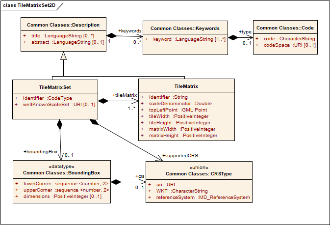
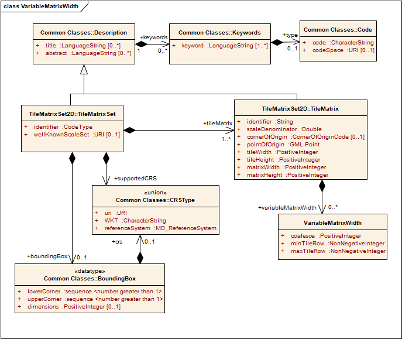
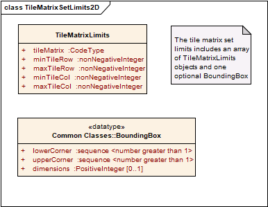

[[tilematrixset2d-model]]
== TileMatrixSet2D model

[[tilematrixset2d-requirements-class]]
=== TileMatrixSet2D requirements class

Requirements class tilematrixset2D establishes how to describe a TileMatrixSet for a two-dimensional tile space. It is expected that tile matrix sets are defined once and that servers or encodings using or distributing tiles will declare the usage of a tile matrix set by linking to that tile matrix set. The identifying URI for this class is http://www.opengis.net/spec/tilematrixset/1.1/req/tilematrixset2d.

include::requirements/REQ_tilematrixset2d_model.adoc[]

[#img_tilematrixset-uml-model,reftext='{figure-caption} {counter:figure-num}']
.TileMatrixSet UML model

<<parts-of-tilematrixset-data-structure>> defines the structure of the TileMatrixSet.

[#parts-of-tilematrixset-data-structure,reftext='{table-caption} {counter:table-num}']
.Parts of TileMatrixSet data structure
[width = "100%",options="header"]
|===
| Names | Definition | Data type and values | Multiplicity and use
| identifier

Identifier | Tile matrix set identifier ^g^ | CodeType, as adaptation of MD_Identifier class ISO 19115 | One (mandatory)
|
title ^a^

Title | Title of this tile matrix set, normally used for display to a human | LanguageString data structure. See <<parts-of-descriptiontitlekeyword-elements>> | Zero or more (optional) Include when available and useful

Include one for each language represented ^f^
| abstract ^a^

Abstract | Brief narrative description of this tile matrix set, normally available for display to a human | LanguageString data structure. See <<parts-of-descriptiontitlekeyword-elements>> | Zero or more (optional) Include when available and useful

Include one for each language represented
| keywords^a^

Keywords | Unordered list of one or more commonly used or formalized word(s) or phrase(s) used to describe this tile matrix set | MD_Keywords class in ISO 19115. See <<parts-of-descriptiontitlekeyword-elements>> | Zero or more (optional)

One for each keyword authority used
| bounding‌Box

Bounding‌Box | Minimum bounding rectangle surrounding the tile matrix set, in the supported CRS ^b^ | BoundingBox data structure, see <<parts-of-boundingbox-data-structure>> | Zero or one (optional)

| supportedCRS

SupportedCRS | Coordinate reference system (CRS) | CRSType type, see <<parts-of-crs-type-union>> | One (mandatory)
| wellKnown‌ScaleSet

WellKnown‌ScaleSet | Reference to a well-known scale set ^e^ | URI type | Zero or one (optional) ^c^
| tileMatrix

TileMatrix | Description of a scale level and its tile matrix | TileMatrix data structure. See <<parts-of-tilematrix-data-structure>> | One or more (mandatory) ^d^
4+|
^a^     The multilingual scoping rules in <<multilingualTextEncoding>>>> apply.

^b^     In the same CRS as the TileMatrixSet. boundingBox SHOULD NOT be used to calculate the position of the tiles in the CRS space; please use cornerOfOrigin and pointOfOrigin of the corresponding TileMatrix instead. If data is not available for all tiled space, TileMatrixSetLimits will declare what the tiles have data (see <<tilematrixsetlimits2d-requirements-class>>).

^c^     When a tile matrix set conforms to a well-known scale set it can reference it by its URI. If used, the well-known scale set SHALL be consistent with the supportedCRS and with the scaleDenominators of the tileMatrix parameters.

^d^     Commonly more than one. Each tileMatrix of a tileMatrixSet SHALL have a unique (different) scaleDenominator.

^e^     Some possible values are defined the in Annex C.

^f^     If no Title is specified, a client may display the Identifier value instead.

^g^     TileMatrixSet identifies SHALL be unique (different) for each TileMatrixSet of a server.
|===
A part from the general tile matrix set description an array of tile matrix elements is needed to define the distribution of tiles for each scale denominator.
[#parts-of-tilematrix-data-structure,reftext='{table-caption} {counter:table-num}']
.Parts of TileMatrix data structure
[width = "100%",options="header"]
|===
| Names | Definition | Data type and values | Multiplicity and use
| identifier

Identifier
 |
Tile matrix identifier ^c^
 |
ows:CodeType, as adaptation of MD_Identifier class ISO 19115
 |
One (mandatory)

| title ^a^

Title
 |
Title of this tile matrix, normally used for display to a human
 |
LanguageString data structure. See <<parts-of-descriptiontitlekeyword-elements>>
 |
Zero or more (optional) Include when available and useful

Include one for each language represented ^d^

| abstract ^a^

Abstract
 |
Brief narrative description of this tile matrix, normally available for display to a human
 |
LanguageString data structure. See <<parts-of-descriptiontitlekeyword-elements>>
 |
Zero or more (optional) Include when available and useful

Include one for each language represented

| keywords^c^

Keywords
 |
Unordered list of one or more commonly used or formalized word(s) or phrase(s) used to describe this tile matrix
 |
MD_Keywords class in ISO 19115. See <<parts-of-descriptiontitlekeyword-elements>>
 |
Zero or more (optional)

One for each keyword authority used

| scale‌Denominator

Scale‌Denominator
 |
Scale denominator level of this tile matrix ^f^
 |
Double type
 |
One (mandatory)

| cornerOfOrigin

CornerOfOrigin
 |
Position of the corner of origin with respect of the tiles of this tile matrix
 |
enumeration. See <<parts-of-corner-of-origin-enum>>
 |
Zero or one (optional). Default value is "topLeft"

| pointOfOrigin

PointOfOrigin^e^
 |
Coordinate in CRS coordinates of the corner of origin of this tile matrix
 |
Ordered sequence of double values ^b^
 |
One (mandatory)

| tileWidth

TileWidth
 |
Width of each tile of this tile matrix in pixels
 |
Positive integer type
 |
One (mandatory)

| tileHeight

TileHeight
 |
Height of each tile of this tile matrix in pixels
 |
Positive integer type
 |
One (mandatory)

| matrix‌Width

Matrix‌Width
 |
Width of the matrix (number of tiles in width)
 |
Positive integer type
 |
One (mandatory)

| matrix‌Height

Matrix‌Height
 |
Height of the matrix (number of tiles in height)
 |
Positive integer type
 |
One (mandatory)
4+|
^a^    The multilingual scoping rules in <<multilingualTextEncoding>>>> apply.

^b^    CRS will be inherited from the supportedCRS parameter of the parent TileMatrixSet. The order of these axes shall be as specified by the supportedCRS. These are the precise coordinates of the top left corner of top left pixel of the 0,0 tile. See Figure 1.

^c^    This TileMatrix identifiers SHALL be unique (different) within the context of the parent TileMatrixSet. Many applications use a correlative numeric value as an identifier. Other alternatives are a rounded scale denominator or a rounded pixel size. It is recommended to avoid repeating the TileMatrixSet identifier as part of the TileMatrix identifier.

^d^    If no Title is specified, client may display the Identifier value instead.

^e^    In previous versions was called topLeftCorner and cornerOfOrigin did not exist

^f^    The pixel size of the tile can be obtained from the scaleDenominator by multiplying the later by 0.28 10-3 / metersPerUnit. If the CRS uses _meters_ as units of measure for the horizontal dimensions, then metersPerUnit=1; if it has degrees, then metersPerUnit=2p__a__/360 (_a_ is the Earth maximum radius of the ellipsoid).
|===
 

NOTE: It may be desirable to define a tile matrix set with some general-scale tile matrices in one CRS (_e.g._, CRS:84) and with detailed-scale tile matrices in a different CRS (_e.g._, LCC projection). However, this standard does not allow mixing CRSs. Each tile matrix set declares a single CRS.

NOTE: The width (matrixWidth) and height (matrixHeith) in tiles of each tile matrix is explicitly given, so the range of relevant tile indexes does not have to be calculated by the client application.

NOTE: The bounding box of a tile matrix is not supplied explicitly because it can be calculated from cornerOfOrigin, pointOfOrigin, tileWidth, tileHeight and scaleDenominator.

[#parts-of-corner-of-origin-enum,reftext='{table-caption} {counter:table-num}']
.Parts of CornerOfOriginCode enumeration
[width = "100%",options="header"]
|===
| Names | Definition
| topLeft | Top left corner ^a^
| bottomLeft | Bottom left corner ^b^
2+|
^a^    The only possibility available in WMTS 1.0. Sometimes known as "xyz" in other non OGC specifications.

^b^    Used by Tile Map Service. Sometimes known as "tms" in other non OGC specifications
|===

[[variablematrixwidth-requirements-class]]
=== VariableMatrixWidth requirements class

This extension provides the necessary support for variable matrix width tile matrix sets.

include::requirements/REQ_variablematrixwidth_model.adoc[]

[#img_variablematrixwidth-uml-model,reftext='{figure-caption} {counter:figure-num}']
.VariableMatrixWidth UML model

In order to make the description of the model more compact, only the tile rows that have coalesced (i.e., coalescence factor larger than 1) will be encoded.

[#parts-of-variablematrixwidth-data-structure,reftext='{table-caption} {counter:table-num}']
.Parts of VariableMatrixWidth data structure
[width = "100%",options="header"]
|===
| Names | Definition | Data type and values | Multiplicity and use
| coalesce

Coalesce | Coalescence factor | Positive integer type ^a^ | One (mandatory)
| minTile‌Row

MinTile‌Row | First tile row where the coalese factor apply on this tilematrix | Non negative integer type ^b^ | One (mandatory)
| maxTile‌Row

MaxTile‌Row | Last tile row where the coalese factor apply on this tilematrix | Non negative integer type ^c^ | One (mandatory)
4+| ^a^    Shall be more than 1. Rows with Coalescence factor of 1 shall not be described here.

^b^    From 0 to maxTileRow.

^c^    From minTileRow to matrixWidth-1 of the tileMatrix section of this tileMatrixSet.
|===
 
include::requirements/REQ_variablematrixwidth_coalescence1.adoc[]

[[tilematrixsetlimits2d-requirements-class]]
=== TileMatrixLimits2D requirements class

Requirements class tilematrixsetlimits2D establishes how to describe the limits for a tile set TileMatrixSet. It is expected that many TileMatrixSets are defined only once and reused many times. In these circumstances, the data used to create the tile set may only exist for a partial region of for a subset of scales. The array of TileMatrixLimits2D data structures allows for the declaration of a limited coverage of a tile matrix set. The identifying URI for this class is http://www.opengis.net/spec/tilematrixset/1.1/req/tilematrixsetlimits2d.

include::requirements/REQ_tilematrixsetlimits2d_model.adoc[]

[#img_tilematrixsetlimits-uml-model,reftext='{figure-caption} {counter:figure-num}']
.TileMatrixLimits array UML model

 
[#parts-of-tilematrixsetlimits-data-structure,reftext='{table-caption} {counter:table-num}']
.TileMatrixLimits array
[width = "100%",options="header"]
|===
| Names | Definition | Data type and values | Multiplicity and use
| tileMatrix‌Limits

Tile‌Matrix‌Limits | Indices limits for this tileMatrix | TileMatrixLimits data structure, see <<parts-of-tilematrixlimits-data-structure>> | one or more (mandatory) ^a^

|===
 

[#parts-of-tilematrixlimits-data-structure,reftext='{table-caption} {counter:table-num}']
.Parts of TileMatrixLimits data structure
[width = "100%",options="header"]
|===
| Names | Definition | Data type and values | Multiplicity and use
| tileMatrix

TileMatrix | Reference to a tileMatrix identifier | ows:CodeType, as adaptation of MD_Identifier class ISO 19115 ^a^ | One (mandatory)
| minTile‌Row

MinTile‌Row | Minimum tile row index valid for this layer.
 |
Non negative integer type ^b^
 |
One (mandatory)

| maxTile‌Row

MaxTile‌Row
 |
Maximim tile row index valid for this layer.
 |
Non negative integer type ^c^
 |
One (mandatory)

| minTile‌Col

MinTile‌Col
 |
Minimum tile column index valid for this tile column.
 |
Non negative integer type ^d^
 |
One (mandatory)

| maxTile‌Col

MaxTile‌Col
 |
Maximum tile column index valid for this tile column.
 |
Non negative integer type ^e^
 |
One (mandatory)
4+|
^a^    SHALL be an identifier to a tileMatrix element of this tileMatrixSet.

^b^    From 0 to maxTileRow.

^c^    From minTileRow to matrixWidth-1 of the tileMatrix of this tileMatrixSet.

^d^    From 0 to maxTileCol.

^e^    From minTileCol to tileHeight-1 of the tileMatrix of this tileMatrixSet.
|===
 
[[tilesetmetadata2d-requirements-class]]
=== TileSetMetadata requirements class

Requirements class tilesetmetadata2d establishes how to describe TileSet Metadata for a two-dimensional tile space. The  tilesetmetadata2d data structure allows for a dataset declaring the use of a tile matrix set defined elsewhere and, if needed, a limited coverage for this tile matrix set, the list of geodata resources used to create the tileset and a recommended center point. Each TileSet in a dataset collection should declare the use of a tile matrix set using this data structure. The identifying URI for this class is http://www.opengis.net/spec/tilematrixset/1.1/req/tilesetmetadata2d.

include::requirements/REQ_tilesetmetadata2d_identifier.adoc[]

NOTE: To determine if two resources or datasets use the same TileMatrixSet, compare their TileMatrixSet identifier. Alternatively, compare TileMatrixSet definitions for an equivalency (a simple calculation can be performed to verify whether or not two given tile matrices are aligned).

NOTE: If the same TileMatrixSet is externally available in more than one format, it is recommended that the format selected is the closer to the original description document format. For example if a OGC API defines tiles using JSON, it is expected to link to a JSON definition of a TileMatrixSet.
 
include::requirements/REQ_tilesetmetadata2d_model.adoc[]

[#img_tilesetmetadata-uml-model,reftext='{figure-caption} {counter:figure-num}']
.TileSetMetadata UML model
image::figures/TileSet.png[TileSetMetadata UML model]

[#parts-of-tilesetmetadata-data-structure,reftext='{table-caption} {counter:table-num}']
.Parts of TileSetMetadata data structure
[width = "100%",options="header"]
|===
| Names | Definition | Data type and values | Multiplicity and use
|
title ^a^

Title | Title of this tile matrix set, normally used for display to a human | LanguageString data structure. See <<parts-of-descriptiontitlekeyword-elements>> | Zero or more (optional) Include when available and useful

Include one for each language represented
| abstract ^a^

Abstract | Brief narrative description of this tile matrix set, normally available for display to a human | LanguageString data structure. See <<parts-of-descriptiontitlekeyword-elements>> | Zero or more (optional) Include when available and useful

Include one for each language represented
| keywords^a^

Keywords | Unordered list of one or more commonly used or formalized word(s) or phrase(s) used to describe this tile set | MD_Keywords class in ISO 19115 See <<parts-of-descriptiontitlekeyword-elements>> | Zero or more (optional)

One for each keyword authority used
| version

Version | Version of the Tile Set. Changes if the data behind the tiles has been changed | CharacterString | Zero or one (optional)

| pointOfContact

PointOfContact | Useful information to contact the authors or custodians for the Tile Set  | CharacterString (e.g. e-mail address, a physical address,  phone numbers, etc) | Zero or one (optional)

| accessConstraints

AccessConstraints | Restrictions on the availability of the Tile Set that the user needs to be aware of before using or redistributing the Tile Set | ClassificationCode code list, see <<parts-of-classification-code-enum>> | Zero or one (optional)

| mediaType

MediaType | Media types available for the tiles | CharacterString restricted by RFC6838 section 4.2 | Zero or more (optional)^f^

| dataType

DataType | Type of data represented in the tiles | DataTypeCode code list | one (mandatory)

| tileMatrix‌Set

Tile‌Matrix‌Set | Tile matrix set definition | TileMatrixSet data strcuture. See <<parts-of-tilematrixset-data-structure>> | Zero or one (optional)^d^

| tileMatrix‌SetURI

Tile‌Matrix‌SetURI | Reference to a tileMatrixSet | URI type^b^ | Zero or One (optional)^d^

| tileMatrix‌SetDefinition

TileMatrix‌SetDefinition | Reference to a tileMatrixSet | URI type^c^
| Zero or One (optional)^d^

| tileMatrix‌Limits

Tile‌Matrix‌Limits | Limits for the TileRow and TileCol values for each TileMatrix in the tileMatrixSet | TileMatrixSetLimits data structure, see <<parts-of-tilematrixsetlimits-data-structure>> | Zero or more (optional) Should be include when the boundary of the data is a fragment of the boundary of the tileMatrixSet ^g^

| boundingBox

BoundingBox | Minimum bounding rectangle surrounding the tileset | BoundingBox data structure, see <<parts-of-boundingbox-data-structure>>^h^ | Zero or one (optional)

| date

Date | Dates of creation, publication, revision, validity and reception of the tile set  | Dates data structure, see <<parts-of-dates-data-structure>> | Zero or one (optional)

| layer

Layer | Layer elements represented in the tile set | GeospatialData data structure, see <<parts-of-geospatial-data-data-structure>> | Zero or more (optional)

| style

Style | Style used to generate the tiles in the tileset | Style data structure, see <<parts-of-style-data-structure>> | Zero or one (optional)^i^

| centerPoint

CenterPoint | Location of a tile that nicely represents the tileset. Implementations may use this center value to set the default location or to present a representative tile in a user interface | TilePoint data structure, see <<parts-of-tilepoint-data-structure>>.| Zero or more (optional)

| link

Link | Links to related resources | WebLink data structure, see <<parts-of-atom-link-data-structure>>.^e^ | Zero or more (optional)
4+|^a^    The multilingual scoping rules in <<multilingualTextEncoding>>>> apply.

^b^     Points to a definition of the TileMatrixSet in the OGC NA definition server (http://www.opengis.net/def/tms/) and extracted from <<annex_d>> and <<annex_h>>)

^c^     Points to a definition of the TileMatrixSet provided by a tile service

^d^     At least one of the TileMatrixSet,  TileMatrixSetURI or TileMatrixSetDefinition SHALL be provided.

^e^     Possible link 'rel' values are: 'dataset' for a URL pointing to the dataset, 'tiles' for a URL template to get the tiles. 'alternate' for a URL pointing to another representation of the TileSetMetadata (e.g a TileJSON file).

^f^     Intended for offline use. In an online use you are supposed to provide links to the tiles that already have the mediaType specified.

^g^     If missing, there are no limits other that the ones imposed by the TileMatrixSet. If present the TileMatrices listed are limited and the rest not available at all.

^h^     In the same CRS than the TileMatrixSet

^i^     If style property mentions a style applied to all layers, the style property in layer should not be used.
|===

A Layer can is a set of geographic objects (all of the same type) together in a way that can be presented to the user. IT can also be a coverage. Its elements are defined with a data structure defined in <<parts-of-geospatial-data-data-structure>>.

[#parts-of-geospatial-data-data-structure,reftext='{table-caption} {counter:table-num}']
.Parts of GeospatialData data structure
[width = "100%",options="header"]
|===
| Names | Definition | Data type and values | Multiplicity and use
|
title ^a^

Title | Title of this tile matrix set, normally used for display to a human | LanguageString data structure. See <<parts-of-descriptiontitlekeyword-elements>> | Zero or more (optional) Include when available and useful

Include one for each language represented
| abstract ^a^

Abstract | Brief narrative description of this tile matrix set, normally available for display to a human | LanguageString data structure. See <<parts-of-descriptiontitlekeyword-elements>> | Zero or more (optional) Include when available and useful

Include one for each language represented
| keywords^a^

Keywords | Unordered list of one or more commonly used or formalized word(s) or phrase(s) used to describe this layer | MD_Keywords class in ISO 19115 See <<parts-of-descriptiontitlekeyword-elements>> | Zero or more (optional)

One for each keyword authority used

| identifier

Identifier | Unique identifier of the Layer | CodeType, as adaptation of MD_Identifier class ISO 19115 | One (mandatory)

| dataType

DataType | Type of data represented in the layer | DataTypeCode code list | one (mandatory)

| geometryType

GeometryType | The geometry type of the features shown in this layer | GeometryTypeCode code list | Zero or more (optional)

| featureType

FeatureType | Feature type identifier | CharacterString | Zero or one (optional)^i^

| pointOfContact

PointOfContact | Useful information to contact the authors or custodians for the Layer | CharacterString  (e.g. e-mail address, a physical address,  phone numbers, etc) | Zero or one (optional)

| publisher

Publisher | Organization or individual responsible for making the layer available | CharacterString | Zero or one (optional)

| theme

Theme | Category where the layer can be grouped | CharacterString | Zero or more (optional)

| supportedCRS

supportedCRS | Coordinate Reference System (CRS) | CRSType type, see <<parts-of-crs-type-union>> | Zero or more (optional)

| minScaleDenominator

MinScaleDenominator | Minimum scale denominator for usage of the layer | double^c^ | Zero or one (optional)^e^

| maxScaleDenominator

MaxScaleDenominator | Maximum scale denominator for usage of the layer | double^c^ | Zero or one (optional)^f^

| maxTileMatrix

MaxTileMatrix | TileMatrix identifier associated with the minScaleDenominator | CharacterString^d^ | Zero or one (optional)^e^

| minTileMatrix

MinTileMatrix | TileMatrix identifier associated with the maxScaleDenominator | CharacterString^d^ | Zero or one (optional)^f^

| boundingBox

BoundingBox | Minimum bounding rectangle surrounding the layer ^g^ | BoundingBox data structure, see <<parts-of-boundingbox-data-structure>> | Zero or one (optional)

| date

Date | Dates of creation, publication, revision, validity and reception of the layer  | Dates data structure, see <<parts-of-dates-data-structure>> | Zero or one (optional)

| style

Style | Style applied to this layer to generate the tiles in the tileset | Style data structure, see <<parts-of-style-data-structure>> | Zero or one (optional)^b^

| stylableLayerSet

StylableLayerSet | Identifiers of styles that can be used in conjunction with this layer | CodeType, as adaptation of MD_Identifier class ISO 19115 | Zero or more (optional)

| propertiesSchema

PropertiesSchema | Properties represented by the features in this layer. Can be the attributes of a feature dataset (datatype=geometries) or the rangeType of a coverage (datatype=coverage) | FeatureAttribute data structure. See <<parts-of-feature-attribute-data-structure>> | Zero or more (optional)

| link

Link | Links to related resources | WebLink data structure, see <<parts-of-atom-link-data-structure>>. ^h^ | Zero or more (optional)

4+|^a^    The multilingual scoping rules in <<multilingualTextEncoding>>>> apply

^b^     If the tileSetMetadata style property mentions a style applied to all layers, this should be omitted

^c^     SHALL be an scaleDenominator defined in one of the TileMatrix of the TileMatrixSet

^d^     SHALL be an identifier to a tileMatrix element of this tileMatrixSet

^e^     If both minScaleDenominator and maxTileMatrix are provided they SHALL refer to the same TileMatrix

^f^     If both maxScaleDenominator and minTileMatrix are provided they SHALL refer to the same TileMatrix

^g^     In the same CRS than the TileMatrixSet

^h^     Possible link 'rel' values are: 'collection' for a URL pointing to the collection represented in this layer

^i^     Only applicable to layers of datatype='geometries'
|===

A FeatureAttribute element contains attributes that can be found in at least one feature belonging to the layer the FeatureAttribute element belongs to. Its elements are defined in <<parts-of-feature-attribute-data-structure>>.

[#parts-of-feature-attribute-data-structure,reftext='{table-caption} {counter:table-num}']
.Parts of FeatureAttribute data structure
[width = "100%",options="header"]
|===
| Names | Definition | Data type and values | Multiplicity and use
|
title ^a^

Title | Title of this tile matrix set, normally used for display to a human | LanguageString data structure. See <<parts-of-descriptiontitlekeyword-elements>> | Zero or more (optional) Include when available and useful

Include one for each language represented ^f^
| abstract ^a^

Abstract | Brief narrative description of this tile matrix set, normally available for display to a human | LanguageString data structure. See <<parts-of-descriptiontitlekeyword-elements>> | Zero or more (optional) Include when available and useful

Include one for each language represented
| keywords^a^

Keywords | Unordered list of one or more commonly used or formalized word(s) or phrase(s) used to describe this attribute | MD_Keywords class in ISO 19115. See <<parts-of-descriptiontitlekeyword-elements>> | Zero or more (optional)

One for each keyword authority used

| identifier

Identifier | Identifier of the attribute | CodeType, as adaptation of MD_Identifier class ISO 19115 | One (mandatory)

| type

Type | The data type of the attribute | CharacterString | One (mandatory)

| pattern

Pattern | Regular expression to validate the values of the attribute | CharacterString | Zero or one (optional)^b^

| mediaType
MediaType | Encodings of a complex attribute (e.g. image/png) | CharacterString restricted by RFC6838 section 4.2 | Zero or one (optional)^b^

| acceptedValues

AcceptedValues | Valid values of the attribute | CharacterString | Zero or more (optional)^b^

| range

Range
| Range of valid values expressed as an array of two items | CharacterString | Zero or two (optional)^b^

| lowerMultiplicity
LowerMultiplicity | Lower multiplicity of the attribute | Non negative integer | Zero or one (optional)^c^

| upperMultiplicity
UpperMultiplicity | Upper Multiplicity of the property | Non negative integer. Use '*' for 'unbounded'  | Zero or one (optional)^d^

| observedProperty
ObservedProperty
| Measured phenomenon (variable) label, commonly a descriptive name | CharacterString | Zero or one (optional)

| observedPropertyURI
ObservedPropertyURI | URI pointing to a representation of the definition of the measured phenomenon (variable) | URI | Zero or one (optional)

| uom

UoM | Units of measure characterizing the values of the attribute | CharacterString | Zero or one (optional)

| uomURI

UoMURI | URI pointing to a representation of the definition of the units of measure characterizing the values of the attribute | CharacterString | Zero or one (optional)
4+|
^a^     The multilingual scoping rules in <<multilingualTextEncoding>>>> apply.

^b^     If missing all values compatible with the other restrictions are accepted

^c^     If missing, 0 (optional) is assumed

^d^     If missing, many (unbounded) is assumed
|===

A Tile Set or a Layer can contain a single date entry with dates for each of the types, as defined in <<parts-of-dates-data-structure>>.

[#parts-of-dates-data-structure,reftext='{table-caption} {counter:table-num}']
.Parts of Dates data structure
[width = "100%",options="header"]
|===
| Names | Definition | Data type and values | Multiplicity and use
| createdOn

CreatedOn | Timestamp indicating when the Tile Set was first produced | DateTime | Zero or one (optional)

| publishedOn

PublishedOn | Timestamp indicating when the Tile Set was first made available to the users | DateTime | Zero or one (optional)

| revisedOn

RevisedOn | Timestamp of the last Tile Set change/revision | DateTime | Zero or one (optional)

| receivedOn
ReceivedOn | Timestamp indicating when the Tile Set was received from an external provider | DateTime | Zero or one (optional)

| validUntil

ValidUntil | Timestamp marking the future validity of the Tile Set (the Tile Set may no longer be applicable at this date, or that a new revision of the Tile Set is going to be issued) | DateTime | Zero or one (optional)
|===

The style structure applicable to the layer is defined in <<parts-of-style-data-structure>>.

[#parts-of-style-data-structure,reftext='{table-caption} {counter:table-num}']
.Parts of Style data structure
[width = "100%",options="header"]
|===
| Names | Definition | Data type and values | Multiplicity and use
title ^a^

Title | Title of this style, normally used for display to a human | LanguageString data structure. See <<parts-of-descriptiontitlekeyword-elements>> | Zero or more (optional) Include when available and useful

Include one for each language represented ^f^
| abstract ^a^

Abstract | Brief narrative description of this style, normally available for display to a human | LanguageString data structure. See <<parts-of-descriptiontitlekeyword-elements>> | Zero or more (optional) Include when available and useful

Include one for each language represented
| keywords ^a^

Keywords | Unordered list of one or more commonly used or formalized word(s) or phrase(s) used to describe this style | MD_Keywords class in ISO 19115. See <<parts-of-descriptiontitlekeyword-elements>> | Zero or more (optional)

One for each keyword authority used

| identifier

Identifier | Identifier of a style | CodeType, as adaptation of MD_Identifier class ISO 19115 | One (mandatory)

| link

Link | Links to style related resources | WebLink data structure, see <<parts-of-atom-link-data-structure>>. ^b^ | Zero or more (optional)
4+|^a^    The multilingual scoping rules in <<multilingualTextEncoding>>>> apply
  |
^b^     Possible link 'rel' values are: 'style' for a URL pointing to the style description, 'styleSpec' for a URL pointing to the specification or standard used to define the style.
|===

The levels of classification applicable to the tile set is defined in <<parts-of-classification-code-enum>>.

[#parts-of-classification-code-enum,reftext='{table-caption} {counter:table-num}']
.Parts of ClassificationCode code list
[width = "100%",options="header"]
|===
| Names | Definition
| unclassified | Available for general disclosure
| restricted | Not for general disclosure
| confidential | Available for someone who can be entrusted with information
| secret | Kept or meant to be kept private, unknown, or hidden from all but a select group of people
| topSecret | Of the highest secrecy
|===

The data type applicable to the tileset or the layer is defined in <<parts-of-data-type-code-enum>>.

[#parts-of-data-type-code-enum,reftext='{table-caption} {counter:table-num}']
.Parts of DataTypeCode code list
[width = "100%",options="header"]
|===
| Names | Definition
| map | Images representing colors for pictorial representation on the screen
| vector | Vector based elements. E.g. Features composed by geometries and properties
| coverage | Images with values representing physical quantities
|===

The geometry type applicable to the geometries of the layer is defined in <<parts-of-geometry-type-code-enum>>.

[#parts-of-geometry-type-code-enum,reftext='{table-caption} {counter:table-num}']
.Parts of GeometryTypeCode enumeration
[width = "100%",options="header"]
|===
| Names | Definition
| points | 0D geometries
| lines | 1D geometries
| polygons | 2D geometries
|===

A center point is a place and scaleDemoninator that results in a tile that is representative of the tileset. A tile that contains some variety of objects, is visually appealing and easy to understand will be selected. The center point data structure applicable to the tile set is defined in <<parts-of-tilepoint-data-structure>>.

[#parts-of-tilepoint-data-structure,reftext='{table-caption} {counter:table-num}']
.Parts of TilePoint data structure
[width = "100%",options="header"]
|===
| Names | Definition | Data type and values | Multiplicity and use
| coordinates

Coordinates | Location of the center point of the tile set | GM_Point data structure | one (mandatory)
| tileMatrix

TileMatrix | Tile matrix identifier | CodeType, as adaptation of MD_Identifier class ISO 19115^a^ | One (mandatory)
^a^     SHALL be an identifier to a tileMatrix element of this tileMatrixSet.
|===
