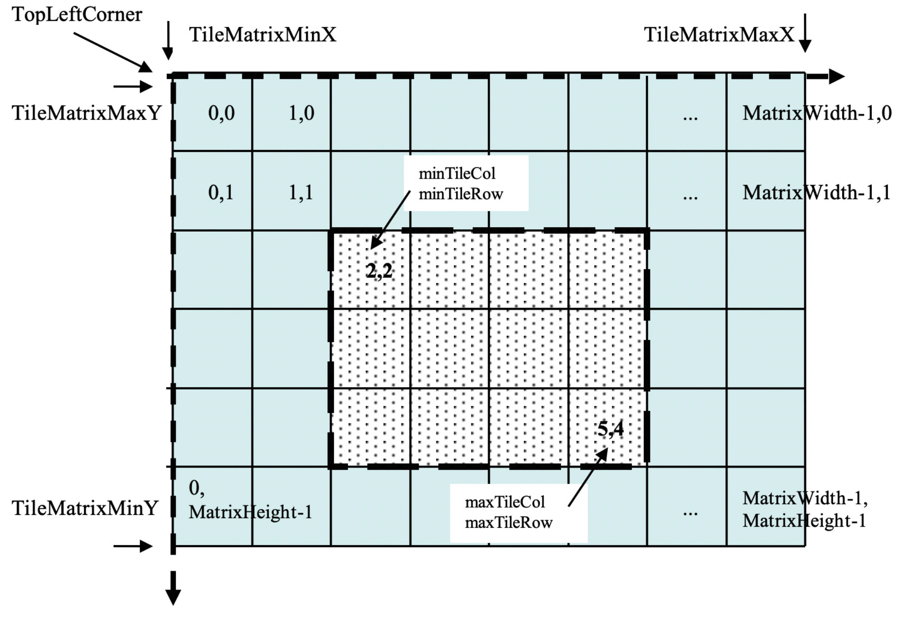
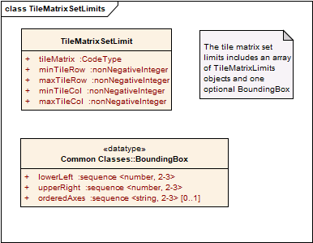
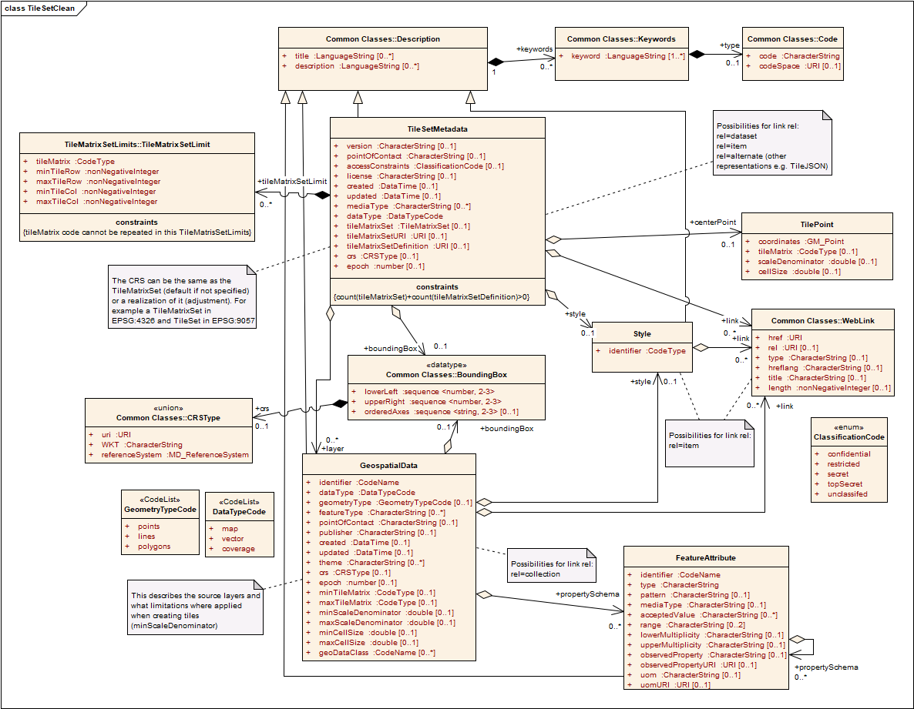

[[tile-set-metadata]]
== TileSetMetadata

=== Overview

[[tile-matrix-set-limits-overview]]
==== TileMatrixSet limits

Imagine a case where a tileset covers all the bounding box of a tile matrix set. Now, imagine that the tileset extent needs to be expanded beyond the point and corner of origin of each TileMatrix. Changing the point of origin changes the position of any tile row and tile column indices. In other words, in the new tileset, tiles that cover the same bounding box than the previous tileset receives different tile row and tile column indices. This invalidates any cached tile that the client could have stored and all client copies need to be updated. To overcome this problem, a dataset can optionally use a more generic TileMatrixSet that covers a bigger area (or even global one, such as one of defined in <<annex-common-tilematrixset-definitions-informative>>). In fact, that TileMatrixSet that defines an area that might be covered by the dataset in a future could easily be shared for many datasets and become a common TileMatrixSet.

To inform the client about the valid range of tile indices in a tileset, the TileMatrixSetLimits concept is introduced. A list of TileMatrixSetLimit informs the minimum and maximum limits of these indices for each TileMatrix that contains actual data. The area outside these limits is considered empty space and is not cover by the tileset.

[#img_tilematrix-limits,reftext='{figure-caption} {counter:figure-num}']
.TileMatrixSet Limits

[[tileset-medatadata-overview]]
==== TileSet metadata

Tiles are identified by tileMatrix id, tileRow number and tileCol number. These three elements only have meaning if they are associated to a tileMatrixSet description that contains the necessary information (in terms of scaleDenominator, cellSize, pointOfOrigin and cornerOfOrigin) to transform the indices into coordinates in a known CRS. The main purpose of the TileSetMetadata is to link the tileset with the tileMatrixSet description. In addition, the model contains elements describing the main characteristics of a tile set, the connection to the tileset with the original data collection and styles as well as a recommended center point to start the navigation.

=== Requirements classes

[[tilematrixsetlimits-requirements-class]]
==== TileMatrixSetLimits requirements class

Requirements class tilematrixsetlimits establishes how to describe the limits for a tile set TileMatrixSet. It is expected that most TileMatrixSets will be defined only once and reused many times. In these circumstances, the data used to create the tile set may only exist for a partial region or for a subset of scales. The array of TileMatrixSetLimits data structures allows for the declaration of a limited coverage of a tile matrix set. The identifying URI for this class is http://www.opengis.net/spec/tms/2.0/req/tilematrixsetlimits.

include::requirements/requirements_tilematrixsetlimits.adoc[]

include::requirements/tilematrixsetlimits/REQ_tilematrixsetlimits_model.adoc[]

[#img_tilematrixsetlimits-uml-model,reftext='{figure-caption} {counter:figure-num}']
.TileMatrixLimit array UML model

 
[#parts-of-tilematrixsetlimits-data-structure,reftext='{table-caption} {counter:table-num}']
.TileMatrixSetLimits array
[width = "100%",options="header"]
|===
| Names | Definition | Data type and values | Multiplicity and use
| tileMatrixSetLimit | Indices limits for a tileMatrix | TileMatrixSetLimits data structure, see <<parts-of-tilematrixlimits-data-structure>> | one or more (mandatory)
|===
 

[#parts-of-tilematrixlimits-data-structure,reftext='{table-caption} {counter:table-num}']
.Parts of TileMatrixLimit data structure
[width = "100%",options="header"]
|===
| Names | Definition | Data type and values | Multiplicity and use
| tileMatrix | Reference to a tileMatrix identifier | ows:CodeType, as adaptation of MD_Identifier class ISO 19115 ^a^ | One (mandatory)
| minTileRow | Minimum tile row index valid for a tileset. | Non negative integer type ^b^ | One (mandatory)
| maxTileRow | Maximim tile row index valid for a tileset. | Non negative integer type ^c^ | One (mandatory)
| minTileCol | Minimum tile column index valid for a tileset. | Non negative integer type ^d^ | One (mandatory)
| maxTileCol | Maximum tile column index valid for a tileset. | Non negative integer type ^e^ | One (mandatory)
4+|
^a^    SHALL be an identifier to a tileMatrix element of this tileMatrixSet.

^b^    From 0 to maxTileRow.

^c^    From minTileRow to matrixWidth-1 of the tileMatrix of this tileMatrixSet.

^d^    From 0 to maxTileCol.

^e^    From minTileCol to tileHeight-1 of the tileMatrix of this tileMatrixSet.
|===
 
[[tilesetmetadata-requirements-class]]
==== TileSetMetadata requirements class

Requirements class TileSetMetadata establishes how to describe TileSet Metadata for a two-dimensional tile space. The TileSetMetadata data structure enables a resource to declare the use of a tile matrix set defined elsewhere and, if needed, a limited extent for this tile matrix set, the list of geospatial resources used to create the tileset and a recommended center point. Each TileSet in a geospatial resource should declare the use of a tile matrix set using this data structure. The identifying URI for this class is http://www.opengis.net/spec/tms/2.0/req/tilesetmetadata

include::requirements/requirements_tilesetmetadata.adoc[]

include::requirements/tilesetmetadata/REQ_tilesetmetadata_identifier.adoc[]

NOTE: To determine if two resources or datasets use the same TileMatrixSet, compare their TileMatrixSet identifier. Alternatively, compare TileMatrixSet definitions for an equivalency (a simple calculation can be performed to verify whether or not two given tile matrices are aligned).

NOTE: If the same TileMatrixSet is externally available in more than one format, it is recommended that the format selected is the closer to the original description document format. For example, if an OGC API defines tiles using JSON, it is expected to link to a JSON definition of a TileMatrixSet.
 
include::requirements/tilesetmetadata/REQ_tilesetmetadata_model.adoc[]

[#img_tilesetmetadata-uml-model,reftext='{figure-caption} {counter:figure-num}']
.TileSetMetadata UML model

[#parts-of-tilesetmetadata-data-structure,reftext='{table-caption} {counter:table-num}']
.Parts of TileSetMetadata data structure
[width = "100%",options="header"]
|===
| Names | Definition | Data type and values | Multiplicity and use
| title ^a^ | Title of a tile set, normally used for display to a human | LanguageString data structure. See <<parts-of-descriptiontitlekeyword-elements>> | Zero or more (optional) Include when available and useful

Include one for each language represented
| description ^a^ | Brief narrative description of a tile set, normally available for display to a human | LanguageString data structure. See <<parts-of-descriptiontitlekeyword-elements>> | Zero or more (optional) Include when available and useful

Include one for each language represented
| keywords ^a^ | Unordered list of one or more commonly used or formalized word(s) or phrase(s) used to describe a tile set | MD_Keywords class in ISO 19115 See <<parts-of-descriptiontitlekeyword-elements>> | Zero or more (optional)

One for each keyword authority used
| version | Version of a tile Set. Changes if the data behind the tiles has been changed | CharacterString | Zero or one (optional)

| pointOfContact | Useful information to contact the authors or custodians for the tile set  | CharacterString (e.g. e-mail address, a physical address,  phone numbers, etc) | Zero or one (optional)

| accessConstraints | Restrictions on the availability of the tile set that the user needs to be aware of before using or redistributing the Tile Set | ClassificationCode code list, see <<parts-of-classification-code-enum>> | Zero or one (optional)

| license | License applicable to the tiles | CharacterString | Zero or one (optional)

| mediaType | Media types available for the tiles | CharacterString restricted by RFC6838 section 4.2 | Zero or more (optional)^f^

| dataType | Type of data represented in the tiles | DataTypeCode code list | one (mandatory)

| crs | Coordinate Reference System (CRS)^j^ | CRSType type, see <<parts-of-crs-type-union>> | Zero or one (optional)

| epoch | Epoch of the Coordinate Reference System (CRS) | Number | Zero or one (optional)

| tileMatrixSet | Tile matrix set definition | TileMatrixSet data structure. See <<parts-of-tilematrixset-data-structure>> | Zero or one (optional)^d^

| tileMatrixSetURI | Reference to a Tile Matrix Set on an official source for the Tile Matrix Set definitions | URI type^b^ | Zero or One (optional) Include if the tile matrix set for this tileset is available in an accessible official source

| tileMatrixSetLimit | Limits for the TileRow and TileCol values for each TileMatrix in the tileMatrixSet | TileMatrixSetLimits data structure, see <<parts-of-tilematrixsetlimits-data-structure>> | Zero or more (optional) Should be include when the boundary of the data is a fragment of the boundary of the tileMatrixSet ^g^

| boundingBox | Minimum bounding rectangle surrounding the tileset | BoundingBox data structure, see <<parts-of-boundingbox-data-structure>>^h^ | Zero or one (optional)

| created | Timestamp indicating when the Tile Set was first produced | DateTime | Zero or one (optional)

| updated | Timestamp of the last Tile Set change/revision | DateTime | Zero or one (optional)

| layer | Layer elements represented in the tile set | GeospatialData data structure, see <<parts-of-geospatial-data-data-structure>> | Zero or more (optional)

| style | Style used to generate the tiles in the til eset | Style data structure, see <<parts-of-style-data-structure>> | Zero or one (optional)^i^

| centerPoint | Location of a tile that nicely represents the tile set. Implementations may use this center value to set the default location or to present a representative tile in a user interface | TilePoint data structure, see <<parts-of-tilepoint-data-structure>>.| Zero or more (optional)

| link | Links to related resources | WebLink data structure, see <<parts-of-atom-link-data-structure>>.^d,e^ | Zero or more (optional)
4+|^a^    The multilingual scoping rules in <<multilingualTextEncoding>> apply.

^b^     Points to a definition of the TileMatrixSet in and official source for tile matrix sets such as the OGC NA definition server (http://www.opengis.net/def/tms/) (including definitions from <<annex-common-tilematrixset-definitions-informative>> and <<annex-variable-tilematrixset-definitions-informative>>)

^d^     At least one of the TileMatrixSet, or a link with `rel`=tiling-scheme SHALL be provided.

^e^     Possible link 'rel' values are: 'dataset' for a URL pointing to the dataset, 'item' for a URL template to get a tile; 'alternate' for a URL pointing to another representation of the TileSetMetadata (e.g a TileJSON file); 'tiling-scheme' for a definition of the TileMatrixSet; 'geodata' for pointing to a single collection (if the tileset represents a single collection);

^f^     Intended for offline use. In an online use you are supposed to provide links to the tiles that already have the mediaType specified.

^g^     If missing, there are no limits other that the ones imposed by the TileMatrixSet. If present the TileMatrices listed are limited and the rest not available at all.

^h^     If the bounding box does not specify a CRS, it is inherited from the CRS of the TileSet if available, otherwise from the TileMatrixSet.

^i^     If style property mentions a style applied to all layers, the style property in layer should not be used.

^j^     It should be compatible with the CRS of the TileMatrixSet. In case the axis order is different from the TileMatrixSet the order of the CRS defined here prevails. See <<TileMatrixSetCRSCompatibility>>
|===

A Layer can is a set of geographic objects (all of the same type) together in a way that can be presented to the user. A layer can also be a coverage. Its elements are defined with a data structure defined in <<parts-of-geospatial-data-data-structure>>.

[#parts-of-geospatial-data-data-structure,reftext='{table-caption} {counter:table-num}']
.Parts of GeospatialData data structure
[width = "100%",options="header"]
|===
| Names | Definition | Data type and values | Multiplicity and use
| title ^a^ | Title of a geospatial data, normally used for display to a human | LanguageString data structure. See <<parts-of-descriptiontitlekeyword-elements>> | Zero or more (optional) Include when available and useful

Include one for each language represented
| description ^a^ | Brief narrative description of a geospatial data, normally available for display to a human | LanguageString data structure. See <<parts-of-descriptiontitlekeyword-elements>> | Zero or more (optional) Include when available and useful

Include one for each language represented
| keywords ^a^ | Unordered list of one or more commonly used or formalized word(s) or phrase(s) used to describe a geospatial data | MD_Keywords class in ISO 19115 See <<parts-of-descriptiontitlekeyword-elements>> | Zero or more (optional)

One for each keyword authority used

| identifier | Unique identifier of a geospatial data | CodeType, as adaptation of MD_Identifier class ISO 19115 | One (mandatory)

| dataType | Type of data represented in a geospatial data | DataTypeCode code list | one (mandatory)

| geometryType | The geometry type of the features shown in a geospatial data | GeometryTypeCode code list | Zero or more (optional)

| featureType | Feature type identifier | CharacterString | Zero or one (optional)^i^

| pointOfContact | Useful information to contact the authors or custodians for a geospatial data | CharacterString  (e.g. e-mail address, a physical address,  phone numbers, etc) | Zero or one (optional)

| publisher | Organization or individual responsible for making a geospatial data available | CharacterString | Zero or one (optional)

| theme | Category where a geospatial data can be grouped | CharacterString | Zero or more (optional)

| crs | Coordinate Reference System (CRS) | CRSType type, see <<parts-of-crs-type-union>> | Zero or more (optional)

| minScaleDenominator | Minimum scale denominator for usage of a geospatial data | double^c^ | Zero or one (optional)^e^

| minCellSize | Minimum cell size for usage of a geospatial data | double^c^ | Zero or one (optional)^e^

| maxScaleDenominator | Maximum cell size for usage of a geospatial data | double^c^ | Zero or one (optional)^f^

| maxCellSize | Maximum scale denominator for usage of a geospatial data | double^c^ | Zero or one (optional)^f^

| maxTileMatrix | TileMatrix identifier associated with the minScaleDenominator | CharacterString^d^ | Zero or one (optional)^e^

| minTileMatrix | TileMatrix identifier associated with the maxScaleDenominator | CharacterString^d^ | Zero or one (optional)^f^

| boundingBox | Minimum bounding rectangle surrounding a geospatial data ^g^ | BoundingBox data structure, see <<parts-of-boundingbox-data-structure>> | Zero or one (optional)

| created | Timestamp indicating when a geospatial data was first produced | DateTime | Zero or one (optional)

| updated | Timestamp of the last geospatial data change/revision | DateTime | Zero or one (optional)

| style | Style applied to a geospatial data to generate the tiles in the tile set | Style data structure, see <<parts-of-style-data-structure>> | Zero or one (optional)^b^

| geoDataClass | URI identifying a class of data contained in a geospatial data (useful to determine compatibility with styles or processes) | CodeType, as adaptation of MD_Identifier class ISO 19115 | Zero or more (optional)

| propertySchema | Properties represented by the features in a geospatial data. Can be the attributes of a feature dataset (datatype=geometries) or the rangeType of a coverage (datatype=coverage) | FeatureAttribute data structure. See <<parts-of-feature-attribute-data-structure>> | Zero or more (optional)

| link | Links to related resources | WebLink data structure, see <<parts-of-atom-link-data-structure>>. ^h^ | Zero or more (optional)

4+|^a^    The multilingual scoping rules in <<multilingualTextEncoding>> apply

^b^     If the tileSetMetadata style property mentions a style applied to all geospatial data, this should be omitted

^c^     SHALL be an scaleDenominator defined in one of the TileMatrix of the TileMatrixSet

^d^     SHALL be an identifier to a tileMatrix element of this TileMatrixSet

^e^     If minCellSize, minScaleDenominator and maxTileMatrix are provided they SHALL be related to the same TileMatrix

^f^     If maxCellSize, maxScaleDenominator and minTileMatrix are provided they SHALL be related to the same TileMatrix

^g^     In the same CRS than the TileMatrixSet

^h^     Possible link 'rel' values are: 'geodata' for a URL pointing to the collection of geospatial data.

^i^     Only applicable to geospatial data of datatype='geometries'
|===

NOTE: the link 'rel' used here with semantics of pointing from the GeospatialData class to point to a collection representing it cannot be 'collection' because IANA semantics for 'collection' implies that the source is an item and the target a 'collection' of items. We use 'geodata' instead.

A FeatureAttribute element contains attributes that can be found in at least one feature belonging to the layer the FeatureAttribute element belongs to. Its elements are defined in <<parts-of-feature-attribute-data-structure>>.

[#parts-of-feature-attribute-data-structure,reftext='{table-caption} {counter:table-num}']
.Parts of FeatureAttribute data structure
[width = "100%",options="header"]
|===
| Names | Definition | Data type and values | Multiplicity and use
| title ^a^ | Title of a feature attribute, normally used for display to a human | LanguageString data structure. See <<parts-of-descriptiontitlekeyword-elements>> | Zero or more (optional) Include when available and useful

Include one for each language represented ^f^
| description ^a^ | Brief narrative description of a feature attribute, normally available for display to a human | LanguageString data structure. See <<parts-of-descriptiontitlekeyword-elements>> | Zero or more (optional) Include when available and useful

Include one for each language represented
| keywords ^a^ | Unordered list of one or more commonly used or formalized word(s) or phrase(s) used to describe a feature attribute | MD_Keywords class in ISO 19115. See <<parts-of-descriptiontitlekeyword-elements>> | Zero or more (optional)

One for each keyword authority used

| identifier | Identifier of a feature attribute | CodeType, as adaptation of MD_Identifier class ISO 19115 | One (mandatory)

| type | The data type of a feature attribute | CharacterString | One (mandatory)

| pattern | Regular expression to validate the values of a feature attribute | CharacterString | Zero or one (optional)^b^

| mediaType | Encodings of a complex feature attribute (e.g. image/png) | CharacterString restricted by RFC6838 section 4.2 | Zero or one (optional)^b^

| acceptedValues | Valid values of a feature attribute | CharacterString | Zero or more (optional)^b^

| range | Range of valid values expressed as an array of two items | CharacterString | Zero or two (optional)^b^

| lowerMultiplicity | Lower multiplicity of a feature attribute | Non negative integer | Zero or one (optional)^c^

| upperMultiplicity | Upper Multiplicity of a feature attribute | Non negative integer. Use '*' for 'unbounded'  | Zero or one (optional)^d^

| observedProperty | Measured phenomenon (variable) label, commonly a descriptive name | CharacterString | Zero or one (optional)

| observedPropertyURI | URI pointing to a representation of the definition of the measured phenomenon (variable) | URI | Zero or one (optional)

| uom | Units of measure characterizing the values of a feature attribute | CharacterString | Zero or one (optional)

| uomURI | URI pointing to a representation of the definition of the units of measure characterizing the values of a feature attribute | CharacterString | Zero or one (optional)
4+|
^a^     The multilingual scoping rules in <<multilingualTextEncoding>> apply.

^b^     If missing all values compatible with the other restrictions are accepted

^c^     If missing, 0 (optional) is assumed

^d^     If missing, many (unbounded) is assumed
|===

The style structure applicable to the geospatial resource is defined in <<parts-of-style-data-structure>>.

[#parts-of-style-data-structure,reftext='{table-caption} {counter:table-num}']
.Parts of Style data structure
[width = "100%",options="header"]
|===
| Names | Definition | Data type and values | Multiplicity and use
| title ^a^ | Title of a style, normally used for display to a human | LanguageString data structure. See <<parts-of-descriptiontitlekeyword-elements>> | Zero or more (optional) Include when available and useful

Include one for each language represented ^f^
| description ^a^ | Brief narrative description of a style, normally available for display to a human | LanguageString data structure. See <<parts-of-descriptiontitlekeyword-elements>> | Zero or more (optional) Include when available and useful

Include one for each language represented
| keywords ^a^ | Unordered list of one or more commonly used or formalized word(s) or phrase(s) used to describe a style | MD_Keywords class in ISO 19115. See <<parts-of-descriptiontitlekeyword-elements>> | Zero or more (optional)

One for each keyword authority used

| identifier | Identifier of a style | CodeType, as adaptation of MD_Identifier class ISO 19115 | One (mandatory)

| link | Links to style related resources | WebLink data structure, see <<parts-of-atom-link-data-structure>>. ^b^ | Zero or more (optional)
4+|^a^    The multilingual scoping rules in <<multilingualTextEncoding>> apply
  |
^b^     Possible link 'rel' values are: 'style' for a URL pointing to the style description, 'styleSpec' for a URL pointing to the specification or standard used to define the style.
|===

The levels of classification applicable to the tile set is defined in <<parts-of-classification-code-enum>>.

[#parts-of-classification-code-enum,reftext='{table-caption} {counter:table-num}']
.Parts of ClassificationCode code list
[width = "100%",options="header"]
|===
| Names | Definition
| unclassified | Available for general disclosure
| restricted | Not for general disclosure
| confidential | Available for someone who can be entrusted with information
| secret | Kept or meant to be kept private, unknown, or hidden from all but a select group of people
| topSecret | Of the highest secrecy
|===

The data type applicable to the tileset or the layer is defined in <<parts-of-data-type-code-enum>>.

[#parts-of-data-type-code-enum,reftext='{table-caption} {counter:table-num}']
.Parts of DataTypeCode code list
[width = "100%",options="header"]
|===
| Names | Definition
| map | Images representing colors for pictorial representation on the screen
| vector | Vector based elements. E.g. Features composed by geometries and properties
| coverage | Coverage rangeset. E.g. Arrays of values representing physical quantities that are function of the position in a regular grid.
|===

The geometry type applicable to the geometries of the layer is defined in <<parts-of-geometry-type-code-enum>>.

[#parts-of-geometry-type-code-enum,reftext='{table-caption} {counter:table-num}']
.Parts of GeometryTypeCode enumeration
[width = "100%",options="header"]
|===
| Names | Definition
| points | 0D geometries
| lines | 1D geometries
| polygons | 2D geometries
|===

A center point is a place and scale that results in a tile that is representative of the tileset. A tile that contains some variety of objects, is visually appealing and easy to understand will be selected. The center point data structure applicable to the tile set is defined in <<parts-of-tilepoint-data-structure>>.

[#parts-of-tilepoint-data-structure,reftext='{table-caption} {counter:table-num}']
.Parts of TilePoint data structure
[width = "100%",options="header"]
|===
| Names | Definition | Data type and values | Multiplicity and use
| coordinates | Location of the center point in the tile set | GM_Point data structure^a^ | one (mandatory)
| crs | Coordinate Reference System (CRS) | CRSType type, see <<parts-of-crs-type-union>> | Zero or one (optional)^b^
| tileMatrix | Tile matrix identifier of the tile | CodeType, as adaptation of MD_Identifier class ISO 19115^c^ | One (mandatory)
| scaleDenominator | Scale denominator of the tile | double^d^ | Zero or one (optional)
| cellSize | Cell size of the tile | double^d^ | Zero or one (optional)
4+|^a^     As specified in the ISO 19107. The CRS and order of these coordinates SHALL be as specified by the _crs_.

^b^     Default value is the CRS of the Tileset and if no specified, the CRS of the TileMatrixSet.

^c^     SHALL be an identifier to a tileMatrix in relevant tileMatrixSet.

^d^     If cellSize and scaleDenominator are provided they SHALL be related to TileMatrix with the indicated tileMatrix
|===
